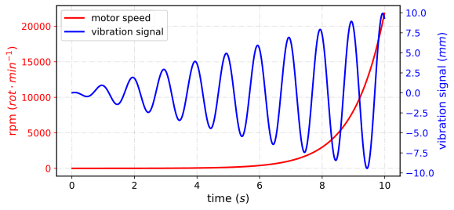

<!--Don't delete ths script-->
<script src = "https://polyfill.io/v3/polyfill.min.js?features=es6"></script>
<script id = "MathJax-script" async src="https://cdn.jsdelivr.net/npm/mathjax@3/es5/tex-mml-chtml.js"></script>
<!--Don't delete ths script-->

<p align = "justify">This function shows a two lines in single chart with different scales.</p>

Input variables
{: .label .label-yellow }

<table style = "width:100%">
    <thead>
      <tr>
        <th>Name</th>
        <th>Description</th>
        <th>Type</th>
      </tr>
    </thead>
    <tr>
        <td>DATASET</td>
        <td>Dataset specifications</td>
        <td>Py dictionary</td>
    </tr>
    <tr>
        <td><i>key</i></td>
        <td><code>'DATASET'</code> = Full dataset</td>
        <td>Py dataframe</td>
    </tr>  
    <tr>
        <td>PLOT_SETUP</td>
        <td>Specifications of chart</td>
        <td>Py dictionary</td>
    </tr>  
    <tr>
        <td><i>key</i></td>
        <td><code>'NAME'</code> = Filename output file</td>
        <td>String</td>
    </tr>  
    <tr>
        <td><i>key</i></td>
        <td><code>'WIDTH'</code> = Width figure in centimeters</td>
        <td>Float</td>
    </tr>
    <tr>
        <td><i>key</i></td>
        <td><code>'HEIGHT'</code> = Height figure in centimeters</td>
        <td>Float</td>
    </tr>  
    <tr>
        <td><i>key</i></td>
        <td><code>'MARKER'</code> = Line marker style (see matplotlib <a href="https://matplotlib.org/stable/api/markers_api.html#module-matplotlib.markers" target="_blank">documentation</a>)</td>
        <td>String</td>
    </tr>
    <tr>
        <td><i>key</i></td>
        <td><code>'MARKER SIZE'</code> = Line marker size</td>
        <td>Float</td>
    </tr>
    <tr>
        <td><i>key</i></td>
        <td><code>'LINE WIDTH'</code> = Line width</td>
        <td>Float</td>
    </tr>
    <tr>
        <td><i>key</i></td>
        <td><code>'LINE STYLE'</code> = Line style (see matplotlib <a href="https://matplotlib.org/stable/gallery/lines_bars_and_markers/linestyles.html" target="_blank">documentation</a>)</td>
        <td>Py list</td>
    </tr>
    <tr>
        <td><i>key</i></td>
        <td><code>'X AXIS LABEL'</code> = \(x\) label name</td>
        <td>String</td>
    </tr>  
    <tr>
        <td><i>key</i></td>
        <td><code>'X AXIS SIZE'</code> = \(x\) font axis size</td>
        <td>Float</td>
    </tr>
    <tr>
        <td><i>key</i></td>
        <td><code>'Y0 AXIS LABEL'</code> = \(y_0\) label name</td>
        <td>String</td>
    </tr>
    <tr>
        <td><i>key</i></td>
        <td><code>'Y1 AXIS LABEL'</code> = \(y_1\) label name</td>
        <td>String</td>
    </tr>   
    <tr>
        <td><i>key</i></td>
        <td><code>'Y AXIS SIZE'</code> = \(y\) font axis size</td>
        <td>Float</td>
    </tr>  
    <tr>
        <td><i>key</i></td>
        <td><code>'LABELS SIZE'</code> = Labels size</td>
        <td>Float</td>
    </tr>
    <tr>
        <td><i>key</i></td>
        <td><code>'CHART COLOR'</code> = Lines and axis color (see matplotlib <a href="https://matplotlib.org/stable/gallery/color/named_colors.html" target="_blank">documentation</a>)</td>
        <td>Py list</td>
    </tr>
    <tr>
        <td><i>key</i></td>
        <td><code>'ON GRID'</code> = Grid on or off</td>
        <td>Boolean (<code>True</code> or <code>False</code>)</td>
    </tr>  
    <tr>
        <td><i>key</i></td>
        <td><code>'LEGEND'</code> = List with the name of lines</td>
        <td>Py list</td>
    </tr> 
    <tr>
        <td><i>key</i></td>
        <td><code>'LOC LEGEND'</code> = The location of the legend (see matplotlib <a href="https://matplotlib.org/stable/api/_as_gen/matplotlib.pyplot.legend.html" target="_blank">documentation</a>)</td>
        <td>String</td>
    </tr>  
    <tr>
        <td><i>key</i></td>
        <td><code>'SIZE LEGEND'</code> = Size legend</td>
        <td>Float</td>
    </tr>  
    <tr>
        <td><i>key</i></td>
        <td><code>'Y LOG'</code> = Make a plot with log scaling on the y-axis.</td>
        <td>Boolean (<code>True</code> or <code>False</code>)</td>
    </tr>
    <tr>
        <td><i>key</i></td>
        <td><code>'X LOG'</code> = Make a plot with log scaling on the x-axis.</td>
        <td>Boolean (<code>True</code> or <code>False</code>)</td>
    </tr> 
    <tr>
        <td><i>key</i></td>
        <td><code>'DPI'</code> = The resolution in Dots Per Inch</td>
        <td>Integer</td>
    </tr>   
    <tr>
        <td><i>key</i></td>
        <td><code>'EXTENSION'</code> = Extension output file (see matplotlib <a href="https://matplotlib.org/stable/api/_as_gen/matplotlib.pyplot.savefig.html" target="_blank">documentation</a>)</td>
        <td>String</td>
    </tr>
</table>

Output variables
{: .label .label-yellow }

<p align = "justify">The function displays the plot on the screen it to the local folder of the ipynb file.</p>

Example 1
{: .label .label-yellow }

<p align = "justify">We use the <code>MULTIPLE_LINES_CHART</code> function to plot a two lines with different scales..</p>

```python
# Data
X = np.arange(0.01, 10.0, 0.01)
DATA_1 = np.exp(X)
DATA_2 = X * np.sin(2 * np.pi * X + 2)
DF =  pd.DataFrame({
                    'x': list(X),
                    'y0': list(DATA_1),
                    'y1': list(DATA_2)
                   })

# Chart setup
CHART_CONFIG = {
              'NAME': 'figure1-10-1',
              'WIDTH': 20., 
              'HEIGHT': 10,
              'MARKER': ['none', 'none'],
              'MARKER SIZE': 2,
              'LINE WIDTH': 2,
              'LINE STYLE': ['-', '-'],
              'X AXIS LABEL': 'time ($s$)',
              'X AXIS SIZE': 12,
              'Y0 AXIS LABEL': 'rpm ($rot \cdot min^{-1}$)',
              'Y1 AXIS LABEL': 'vibration signal ($mm$)',
              'Y AXIS SIZE': 12,
              'LABELS SIZE': 14,
              'CHART COLOR': ['red', 'blue'],
              'ON GRID?': True,
              'LEGEND': ['motor speed', 'vibration signal'],
              'LOC LEGEND': 'upper left',
              'SIZE LEGEND': 12,
              'Y LOG': False,
              'X LOG': False,
              'DPI': 600, 
              'EXTENSION': 'svg'
             }

# Data statement 
DATA = {'DATASET': DF}

# Call function
MULTIPLE_LINES_CHART(DATASET = DATA, PLOT_SETUP = CHART_CONFIG)
```

<center></center>
<p align = "center"><b>Figure 1.</b> Two lines chart example.</p>

[Notebook example](https://drive.google.com/file/d/1vLGDZgtEaRX8uKaaMIEbruJeYAEIiB84/view?usp=sharing){: .btn .btn-outline }