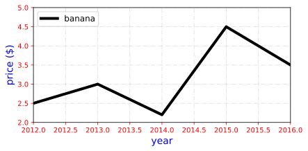
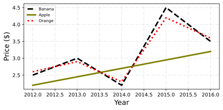

<!--Don't delete ths script-->
<script src = "https://polyfill.io/v3/polyfill.min.js?features=es6"></script>
<script id = "MathJax-script" async src="https://cdn.jsdelivr.net/npm/mathjax@3/es5/tex-mml-chtml.js"></script>
<!--Don't delete ths script-->

<p align = "justify">This function shows a Multiple Lines in single chart.</p>

Input variables
{: .label .label-yellow }

<table style = "width:100%">
    <thead>
      <tr>
        <th>Name</th>
        <th>Description</th>
        <th>Type</th>
      </tr>
    </thead>
    <tr>
        <td>DATASET</td>
        <td>Dataset specifications</td>
        <td>Py dictionary</td>
    </tr>
    <tr>
        <td><i>key</i></td>
        <td><code>'DATASET'</code> = Full dataset</td>
        <td>Py dataframe</td>
    </tr>  
    <tr>
        <td>PLOT_SETUP</td>
        <td>Specifications of chart</td>
        <td>Py dictionary</td>
    </tr>  
    <tr>
        <td><i>key</i></td>
        <td><code>'NAME'</code> = Filename output file</td>
        <td>String</td>
    </tr>  
    <tr>
        <td><i>key</i></td>
        <td><code>'WIDTH'</code> = Width figure in centimeters</td>
        <td>Float</td>
    </tr>
    <tr>
        <td><i>key</i></td>
        <td><code>'HEIGHT'</code> = Height figure in centimeters</td>
        <td>Float</td>
    </tr>  
    <tr>
        <td><i>key</i></td>
        <td><code>'MARKER'</code> = Line marker style (see matplotlib <a href="https://matplotlib.org/stable/api/markers_api.html#module-matplotlib.markers" target="_blank">documentation</a>)</td>
        <td>String</td>
    </tr>
    <tr>
        <td><i>key</i></td>
        <td><code>'MARKER SIZE'</code> = Line marker size</td>
        <td>Float</td>
    </tr>
    <tr>
        <td><i>key</i></td>
        <td><code>'LINE WIDTH'</code> = Line width</td>
        <td>Float</td>
    </tr>
    <tr>
        <td><i>key</i></td>
        <td><code>'LINE STYLE'</code> = Line style (see matplotlib <a href="https://matplotlib.org/stable/gallery/lines_bars_and_markers/linestyles.html" target="_blank">documentation</a>)</td>
        <td>Py list</td>
    </tr>
    <tr>
        <td><i>key</i></td>
        <td><code>'X AXIS LABEL'</code> = \(x\) label name</td>
        <td>String</td>
    </tr>  
    <tr>
        <td><i>key</i></td>
        <td><code>'X AXIS SIZE'</code> = \(x\) font axis size</td>
        <td>Float</td>
    </tr>
    <tr>
        <td><i>key</i></td>
        <td><code>'Y AXIS LABEL'</code> = \(y\) label name</td>
        <td>String</td>
    </tr>  
    <tr>
        <td><i>key</i></td>
        <td><code>'Y AXIS SIZE'</code> = \(y\) font axis size</td>
        <td>Float</td>
    </tr>  
    <tr>
        <td><i>key</i></td>
        <td><code>'AXISES COLOR'</code> = Axis color</td>
        <td>String</td>
    </tr>  
    <tr>
        <td><i>key</i></td>
        <td><code>'LABELS SIZE'</code> = Labels size</td>
        <td>Float</td>
    </tr>
    <tr>
        <td><i>key</i></td>
        <td><code>'LABELS COLOR'</code> = Labels color</td>
        <td>String</td>
    </tr> 
    <tr>
        <td><i>key</i></td>
        <td><code>'CHART COLOR'</code> = Lines color (see matplotlib <a href="https://matplotlib.org/stable/gallery/color/named_colors.html" target="_blank">documentation</a>)</td>
        <td>Py list</td>
    </tr>
    <tr>
        <td><i>key</i></td>
        <td><code>'ON GRID'</code> = Grid on or off</td>
        <td>Boolean (<code>True</code> or <code>False</code>)</td>
    </tr>  
    <tr>
        <td><i>key</i></td>
        <td><code>'LEGEND'</code> = List with the name of lines</td>
        <td>Py list</td>
    </tr> 
    <tr>
        <td><i>key</i></td>
        <td><code>'LOC LEGEND'</code> = The location of the legend (see matplotlib <a href="https://matplotlib.org/stable/api/_as_gen/matplotlib.pyplot.legend.html" target="_blank">documentation</a>)</td>
        <td>String</td>
    </tr>  
    <tr>
        <td><i>key</i></td>
        <td><code>'SIZE LEGEND'</code> = Size legend</td>
        <td>Float</td>
    </tr>  
    <tr>
        <td><i>key</i></td>
        <td><code>'Y LOG'</code> = Make a plot with log scaling on the y-axis.</td>
        <td>Boolean (<code>True</code> or <code>False</code>)</td>
    </tr>
    <tr>
        <td><i>key</i></td>
        <td><code>'X LOG'</code> = Make a plot with log scaling on the x-axis.</td>
        <td>Boolean (<code>True</code> or <code>False</code>)</td>
    </tr> 
    <tr>
        <td><i>key</i></td>
        <td><code>'DPI'</code> = The resolution in Dots Per Inch</td>
        <td>Integer</td>
    </tr>   
    <tr>
        <td><i>key</i></td>
        <td><code>'EXTENSION'</code> = Extension output file (see matplotlib <a href="https://matplotlib.org/stable/api/_as_gen/matplotlib.pyplot.savefig.html" target="_blank">documentation</a>)</td>
        <td>String</td>
    </tr>
</table>

Output variables
{: .label .label-yellow }

<p align = "justify">The function displays the plot on the screen and saves it to the local folder of the <code>.ipynb</code> / <code>.py</code> file.</p>

Example 1
{: .label .label-blue }

<p align = "justify">We use the <code>line_chart</code> function to plot a series of fruit prices.</p>

```python
# Data statement 
df =  {
        'x0': [2012, 2013, 2014, 2015, 2016],
        'y0': [2.50, 3.00, 2.20, 4.50, 3.50]
      }

# Chart setup
chart_config = {
                'name': 'figure_01_line_chart',
                'width': 15., 
                'height': 7.5,
                'extension': 'png',
                'dots per inch': 200, 
                'marker': [None],
                'marker size': [20],
                'line width': [4],
                'line style': ['-'],
                'x axis label': 'year',
                'x axis size': 10,
                'y axis label': 'price ($\$$)',
                'y axis size': 10,
                'axises color': 'red',
                'labels size': 14,
                'labels color': 'blue',
                'chart color': ['#000000'],
                'on grid?': True,
                'legend': ['banana'], # or without legend 'legend': [none]
                'legend location': 'upper left',
                'x limit': [2012, 2016],
                'y limit': [2, 5.00],
                'size legend': 12,
                'y log': False,
                'x log': False,


            }

# Call function
line_chart(dataset=df, plot_setup=chart_config)
```

<center></center>
<p align = "center"><b>Figure 1.</b> Series of Banan prices between 2012 to 2016.</p>

Example 2
{: .label .label-yellow }

<p align = "justify">We use the <code>line_chart</code> function to plot a series of fruit prices.</p>

```python
# Data statement 
df =  {
        'x0': [2012, 2013, 2014, 2015, 2016],
        'y0': [2.5, 3.0, 2.2, 4.5, 3.5],
        'x1': [2012, 2016],
        'y1': [2.2, 3.2],
        'x2': [2012, 2013, 2014, 2015, 2016],
        'y2': [2.6, 2.9, 2.3, 4.2, 3.6]
       }

# Chart setup
chart_config = {
                'name': 'figure_022_line_chart',
                'width': 16.0, 
                'height': 8.0,
                'extension': 'svg',
                'dots per inch': 600, 
                'marker': [None, None, None],
                'marker size': [3, 3, 3],
                'line width': [3, 3, 3],
                'line style': ['--', '-', 'dotted'],
                'x axis label': 'Year',
                'x axis size': 10,
                'y axis label': 'Price ($)',
                'y axis size': 10,
                'axises color': '#000000',
                'labels size': 14,
                'labels color': '#000000',
                'chart color': ['#000000','olive','r'],
                'on grid?': True,
                'legend': ['Banana', 'Apple', 'Orange'],
                'legend location': 'upper left',
                'size legend': 8,
                'x limit': None,
                'y limit': None,
                'y log': False,
                'x log': False,
               }

# Call function
line_chart(plot_setup=chart_config, dataset=df)
```

<center></center>
<p align = "center"><b>Figure 2.</b> Fruit prices series between 2012 to 2016.</p>
