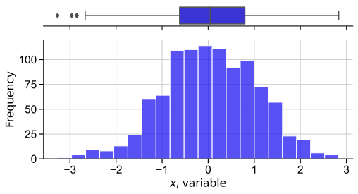
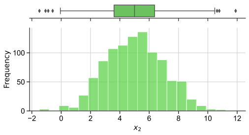
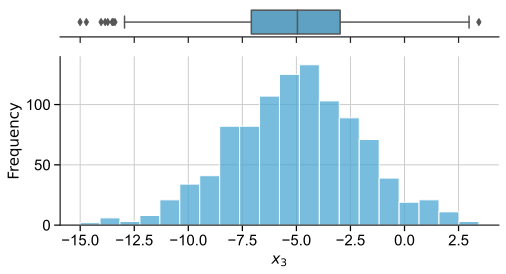

<!--Don't delete ths script-->
<script src = "https://polyfill.io/v3/polyfill.min.js?features=es6"></script>
<script id = "MathJax-script" async src="https://cdn.jsdelivr.net/npm/mathjax@3/es5/tex-mml-chtml.js"></script>
<!--Don't delete ths script-->

<p align = "justify">This function shows a multiple lines in single chart.</p>

Input variables
{: .label .label-yellow }

<table style = "width:100%">
    <thead>
      <tr>
        <th>Name</th>
        <th>Description</th>
        <th>Type</th>
      </tr>
    </thead>
    <tr>
        <td><br>DATASET</br></td>
        <td>Dataset specifications</td>
        <td>Py dictionary</td>
    </tr>
    <tr>
        <td></td>
        <td>'X' = Abscissa axis or x-axis</td>
        <td>Py list</td>
    </tr>  
    <tr>
        <td></td>
        <td>'Y' = Ordinate axis or y-axis</td>
        <td>Py list</td>
    </tr>  
    <tr>
        <td></td>
        <td>'LEGEND' = List with the name of lines</td>
        <td>Py list</td>
    </tr> 
    <tr>
        <td><br>PLOT_SETUP</br></td>
        <td>Specifications of chart</td>
        <td>Py dictionary</td>
    </tr>  
    <tr>
        <td></td>
        <td>'NAME' = Filename output file</td>
        <td>String</td>
    </tr>  
    <tr>
        <td></td>
        <td>'WIDTH' = Width figure</td>
        <td>Float</td>
    </tr>
    <tr>
        <td></td>
        <td>'HEIGHT  = Height figure</td>
        <td>Float</td>
    </tr> 
    <tr>
        <td></td>
        <td>'MARKER' = line marker style (see matplotlib <a href="https://matplotlib.org/stable/api/_as_gen/matplotlib.lines.Line2D.html#matplotlib.lines.Line2D.set_marker" target="_blank">documentation</a>)</td>
        <td>String</td>
    </tr>
    <tr>
        <td></td>
        <td>'MARKER SIZE' = line marker size (see matplotlib <a href="https://matplotlib.org/stable/api/_as_gen/matplotlib.lines.Line2D.html#matplotlib.lines.Line2D.set_markersize" target="_blank">documentation</a>)</td>
        <td>Float</td>
    </tr>
    <tr>
        <td></td>
        <td>'LINE WIDTH' = line width</td>
        <td>Float</td>
    </tr>
    <tr>
        <td></td>
        <td>'LINE STYLE' = line style (see matplotlib <a href="https://matplotlib.org/stable/gallery/lines_bars_and_markers/linestyles.html" target="_blank">documentation Linestyles</a> and <a href="https://matplotlib.org/2.0.2/api/lines_api.html#matplotlib.lines.Line2D.set_linestyle" target="_blank">documentation Lines</a>)</td>
        <td>Py list</td>
    </tr>
    <tr>
        <td></td>
        <td>'X AXIS LABEL' = X label name</td>
        <td>String</td>
    </tr>  
    <tr>
        <td></td>
        <td>'X AXIS SIZE' = X font axis size</td>
        <td>Float</td>
    </tr>
    <tr>
        <td></td>
        <td>'Y AXIS LABEL' = Y label name</td>
        <td>String</td>
    </tr>  
    <tr>
        <td></td>
        <td>'Y AXIS SIZE' = Y font axis size</td>
        <td>Float</td>
    </tr>  
    <tr>
        <td></td>
        <td>'AXISES COLOR' = Axis color</td>
        <td>String</td>
    </tr>  
    <tr>
        <td></td>
        <td>'LABELS SIZE' = Labels size</td>
        <td>Float</td>
    </tr>
    <tr>
        <td></td>
        <td>'LABELS COLOR' = Labels color</td>
        <td>Float</td>
    </tr> 
    <tr>
        <td></td>
        <td>'CHART COLOR' = Lines color (see matplotlib <a href="https://matplotlib.org/stable/gallery/color/named_colors.html" target="_blank">documentation</a>)</td>
        <td>Py list</td>
    </tr>
    <tr>
        <td></td>
        <td>'ON GRID' = Grid on or off</td>
        <td>Boolean</td>
    </tr>  
    <tr>
        <td></td>
        <td>'LOC LEGEND' = The location of the legend (see matplotlib <a href="https://matplotlib.org/stable/api/_as_gen/matplotlib.pyplot.legend.html" target="_blank">documentation</a>)</td>
        <td>String</td>
    </tr>  
    <tr>
        <td></td>
        <td>'SIZE LEGEND' = Size legend</td>
        <td>Float</td>
    </tr>  
    <tr>
        <td></td>
        <td>'Y LOG' = Make a plot with log scaling on the y-axis.</td>
        <td>Boolean</td>
    </tr>
    <tr>
        <td></td>
        <td>'X LOG' = Make a plot with log scaling on the x-axis.</td>
        <td>Boolean</td>
    </tr> 
    <tr>
        <td></td>
        <td>'DPI' = The resolution in Dots Per Inch</td>
        <td>Integer</td>
    </tr>   
    <tr>
        <td></td>
        <td>'EXTENSION' = Extension output file (see matplotlib savefig <a href="https://matplotlib.org/stable/api/_as_gen/matplotlib.pyplot.savefig.html" target="_blank">documentation</a>)</td>
        <td>String</td>
    </tr>
</table>

Output variables
{: .label .label-yellow }

<p align = "justify">The function displays the plot on the screen and saves it to the local folder of the <code>.ipynb</code> / <code>.py</code> file.</p>

Example 1
{: .label .label-yellow }

<p align = "justify">We use the <code>HISTOGRAM_CHART</code> function to plot a series of random numbers with normal distribution.</p>

```python
# Data
DF =  pd.DataFrame({'col1': np.random.normal(0, 1, 1000),
                     'col2': np.random.normal(5, 2, 1000),
                     'col3': np.random.normal(-5, 3, 1000)})
COLUMN = 'col1'

# Chart config
CHART_CONFIG = {
              'NAME': f"{COLUMN}_Histogram",
              'EXTENSION': 'svg',
              'WIDTH': 0.20, 
              'HEIGHT': 0.10,
              'X AXIS LABEL': '$x_{i}$ variable',
              'X AXIS SIZE': 15.5,
              'Y AXIS LABEL': 'Frequency',
              'Y AXIS SIZE': 15.5,
              'AXISES COLOR': '#000000',
              'LABELS SIZE': 15.5,
              'LABELS COLOR': '#000000', 
              'CHART COLOR': '#2219F0',
              'BINS': 20,
              'DPI': 600,
             }

# Data statement 
DATA = {
         'DATASET': DF,
         'COLUMN': COLUMN        
       }  

# Call function
HISTOGRAM_CHART(DATASET = DATA, PLOT_SETUP = CHART_CONFIG)
```

<center></center>
<p align = "center"><b>Figure 1.</b> \(x_{1}\) variable histogram and boxplot.</p>

Example 2
{: .label .label-yellow }

<p align = "justify">We will do the same example shown earlier but using the function inside a looping</p>

```python
# Data
DF =  pd.DataFrame({'col1': np.random.normal(0, 1, 1000),
                     'col2': np.random.normal(5, 2, 1000),
                     'col3': np.random.normal(-5, 3, 1000)})
COLUMN = 'col1'
NAMES = np.array([['$x_{1}$', '#8C0C15'], 
                  ['$x_{2}$', '#5FD34D'],
                  ['$x_{3}$', '#4DA7D3']])
ID = 0

# Plot in looping
for COLUMN in DF:
    # Chart config
    CHART_CONFIG = {
              'NAME': f"{COLUMN}_Histogram",
              'EXTENSION': 'svg',
              'WIDTH': 0.20, 
              'HEIGHT': 0.10,
              'X AXIS LABEL': NAMES[ID, 0],
              'X AXIS SIZE': 15,
              'Y AXIS LABEL': 'Frequency',
              'Y AXIS SIZE': 15,
              'AXISES COLOR': '#000000',
              'LABELS SIZE': 15,
              'LABELS COLOR': '#000000', 
              'CHART COLOR': NAMES[ID, 1],
              'BINS': 20,
              'DPI': 600,
             }
    
    DATA = {
            'DATASET': DF,
            'COLUMN': COLUMN        
           }
    HISTOGRAM_CHART(DATASET = DATA, PLOT_SETUP = CHART_CONFIG)
    ID += 1
```
<center></center>
<p align = "center">
<b>Figure 2.</b> \(x_{1}\) variable histogram and boxplot.</p>

<center></center>
<p align = "center">
<b>Figure 3.</b> \(x_{2}\) variable histogram and boxplot.</p>

<center></center>
<p align = "center">
<b>Figure 4.</b> \(x_{3}\) variable histogram and boxplot.</p>

[Notebook example](https://mega.nz/file/31FFDIAZ#zVEB5y81VjlbIazIijpgqzTFTxLtmqJVpnA6QAF7vjA){: .btn .btn-outline }