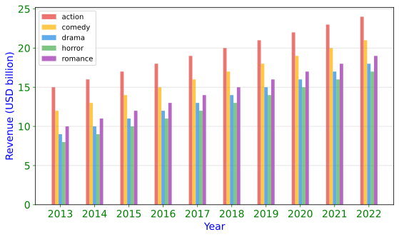

<!--Don't delete ths script-->
<script src = "https://polyfill.io/v3/polyfill.min.js?features=es6"></script>
<script id = "MathJax-script" async src="https://cdn.jsdelivr.net/npm/mathjax@3/es5/tex-mml-chtml.js"></script>
<!--Don't delete ths script-->

<p align = "justify">This function shows a Bar plot in single chart.</p>

Input variables
{: .label .label-yellow }

<table style = "width:100%">
    <thead>
      <tr>
        <th>Name</th>
        <th>Description</th>
        <th>Type</th>
      </tr>
    </thead>
    <tr>
        <td>DATASET</td>
        <td>Dataset specifications</td>
        <td>Py dictionary</td>
    </tr>
    <tr>
        <td><i>key</i></td>
        <td><code>'DATASET'</code> = Full dataset</td>
        <td>Py dataframe</td>
    </tr>  
    <tr>
        <td>PLOT_SETUP</td>
        <td>Specifications of chart</td>
        <td>Py dictionary</td>
    </tr>  
    <tr>
        <td><i>key</i></td>
        <td><code>'NAME'</code> = Filename output file</td>
        <td>String</td>
    </tr>  
    <tr>
        <td><i>key</i></td>
        <td><code>'WIDTH'</code> = Width figure in centimeters</td>
        <td>Float</td>
    </tr>
    <tr>
        <td><i>key</i></td>
        <td><code>'HEIGHT'</code> = Height figure in centimeters</td>
        <td>Float</td>
    </tr>  
    <tr>
        <td><i>key</i></td>
        <td><code>'BAR WIDTH'</code> = Width of the bar</td>
        <td>Float</td>
    </tr>
    <tr>
        <td><i>key</i></td>
        <td><code>'OPACITY'</code> = Opacity of the bar</td>
        <td>Integer</td>
    </tr>
    <tr>
        <td><i>key</i></td>
        <td><code>'X AXIS LABEL'</code> = \(x\) label name</td>
        <td>String</td>
    </tr>  
    <tr>
        <td><i>key</i></td>
        <td><code>'X AXIS SIZE'</code> = \(x\) font axis size</td>
        <td>Float</td>
    </tr>
    <tr>
        <td><i>key</i></td>
        <td><code>'Y AXIS LABEL'</code> = \(y\) label name</td>
        <td>String</td>
    </tr>  
    <tr>
        <td><i>key</i></td>
        <td><code>'Y AXIS SIZE'</code> = \(y\) font axis size</td>
        <td>Float</td>
    </tr>   
    <tr>
        <td><i>key</i></td>
        <td><code>'AXISES COLOR'</code> = Axis color</td>
        <td>String</td>
    </tr>  
    <tr>
        <td><i>key</i></td>
        <td><code>'LABELS SIZE'</code> = Labels size</td>
        <td>Float</td>
    </tr>
    <tr>
        <td><i>key</i></td>
        <td><code>'LABELS COLOR'</code> = Labels color</td>
        <td>String</td>
    </tr> 
    <tr>
        <td><i>key</i></td>
        <td><code>'COLORS'</code> = Bars colors</td>
        <td>Py list</td>
    </tr> 
    <tr>
        <td><i>key</i></td>
        <td><code>'Y LOG'</code> = y log-sacle on or off</td>
        <td>Boolean (<code>True</code> or <code>False</code>)</td>
    </tr>  
    <tr>
        <td><i>key</i></td>
        <td><code>'ON GRID'</code> = Grid on or off</td>
        <td>Boolean (<code>True</code> or <code>False</code>)</td>
    </tr>  
    <tr>
        <td><i>key</i></td>
        <td><code>'DPI'</code> = The resolution in Dots Per Inch</td>
        <td>Integer</td>
    </tr>   
    <tr>
        <td><i>key</i></td>
        <td><code>'EXTENSION'</code> = Extension output file (see matplotlib savefig <a href="https://matplotlib.org/stable/api/_as_gen/matplotlib.pyplot.savefig.html" target="_blank">documentation</a>)</td>
        <td>String</td>
    </tr>
</table>

Output variables
{: .label .label-yellow }

<p align = "justify">The function displays the plot on the screen and saves it to the local folder of the <code>.ipynb</code> / <code>.py</code> file.</p>

Example 1
{: .label .label-yellow }

<p align = "justify">We use the <code>BAR_CHART</code> function to plot a Film Revenue by Category and Year.</p>

```python
# Data
DF =  pd.DataFrame({'x': ['2013', '2014', '2015', '2016', '2017', '2018', '2019', '2020', '2021', '2022'],
                    'Action': [15.00, 16.00, 17.00, 18.00, 19.00, 20.00, 21.00, 22.00, 23.00, 24.00],
                    'Comedy': [12.00, 13.00, 14.00, 15.00, 16.00, 17.00, 18.00, 19.00, 20.00, 21.00],
                    'Drama': [9.00, 10.00, 11.00, 12.00, 13.00, 14.00, 15.00, 16.00, 17.00, 18.00],
                    'Horror': [8.00, 9.00, 10.00, 11.00, 12.00, 13.00, 14.00, 15.00, 16.00, 17.00],
                    'Romance': [10.00, 11.00, 12.00, 13.00, 14.00, 15.00, 16.00, 17.00, 18.00, 19.00]
                   })

# Chart setup  
CHART_CONFIG = {
              'NAME': 'figure1-4-1',
              'WIDTH': 20, 
              'HEIGHT': 12,
              'BAR WIDTH': .10,
              'OPACITY': 0.7,
              'Y AXIS LABEL': 'Revenue (USD billion)',
              'Y AXIS SIZE': 14,
              'X AXIS LABEL': 'Year',
              'X AXIS SIZE': 14,
              'AXISES COLOR': 'green',
              'LABELS SIZE': 14,
              'LABELS COLOR': 'blue',
              'COLORS': ['#E53935', '#FFB300', '#1E88E5', '#4CAF50', '#9C27B0'],
              'ON GRID?': True,
              'Y LOG': False,
              'DPI': 600, 
              'EXTENSION': 'svg',
             }

# Data statement 
DATA = {'DATASET': DF}

# Call function
BAR_CHART(DATASET = DATA, PLOT_SETUP = CHART_CONFIG)
```

<center></center>
<p align = "center"><b>Figure 1.</b> Film Revenue by Category and Year.</p>

[Notebook example](https://drive.google.com/file/d/1rf2oZHfnTU4MBpZyqr25tsnUi26uwgd3/view?usp=sharing){: .btn .btn-outline }
