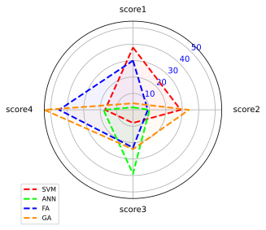

<!--Don't delete ths script-->
<script src = "https://polyfill.io/v3/polyfill.min.js?features=es6"></script>
<script id = "MathJax-script" async src="https://cdn.jsdelivr.net/npm/mathjax@3/es5/tex-mml-chtml.js"></script>
<!--Don't delete ths script-->

<p align = "justify">This function shows a Radar plot in single chart.</p>

Input variables
{: .label .label-yellow }

<table style = "width:100%">
    <thead>
      <tr>
        <th>Name</th>
        <th>Description</th>
        <th>Type</th>
      </tr>
    </thead>
    <tr>
        <td>DATASET</td>
        <td>Dataset specifications</td>
        <td>Py dictionary</td>
    </tr>
    <tr>
        <td><i>key</i></td>
        <td><code>'COMPLETE DATA'</code> = Dataset</td>
        <td>Py dataframe</td>
    </tr>  
    <tr>
        <td><i>key</i></td>
        <td><code>'DIVS'</code> = Radar values</td>
        <td>Py list</td>
    </tr>  
    <tr>
        <td><i>key</i></td>
        <td><code>'DIV LABELS'</code> = Radar labels</td>
        <td>Py list</td>
    </tr>  
    <tr>
        <td>PLOT_SETUP</td>
        <td>Specifications of chart</td>
        <td>Py dictionary</td>
    </tr>  
    <tr>
        <td><i>key</i></td>
        <td><code>'NAME'</code> = Filename output file</td>
        <td>String</td>
    </tr>  
    <tr>
        <td><i>key</i></td>
        <td><code>'WIDTH'</code> = Width figure</td>
        <td>Float</td>
    </tr>
    <tr>
        <td><i>key</i></td>
        <td><code>'HEIGHT'</code> = Height figure</td>
        <td>Float</td>
    </tr> 
    <tr>
        <td><i>key</i></td>
        <td><code>'TEXT SIZE'</code> = Texts and values size</td>
        <td>Float</td>
    </tr>
    <tr>
        <td><i>key</i></td>
        <td><code>'DIV COLOR'</code> = Radar values color</td>
        <td>String</td>
    </tr>
    <tr>
        <td><i>key</i></td>
        <td><code>'RADAR COLOR'</code> = Lines color</td>
        <td>Py list</td>
    </tr>  
    <tr>
        <td><i>key</i></td>
        <td><code>'OPACITY'</code> = Opacity of the filled shape</td>
        <td>Float</td>
    </tr>
    <tr>
        <td><i>key</i></td>
        <td><code>'BACKGROUND'</code> = Background color</td>
        <td>String</td>
    </tr>
    <tr>
        <td><i>key</i></td>
        <td><code>'LEGEND SIZE'</code> = Legend size</td>
        <td>Integer</td>
    </tr> 
    <tr>
        <td><i>key</i></td>
        <td><code>'DPI'</code> = The resolution in Dots Per Inch</td>
        <td>Integer</td>
    </tr>   
    <tr>
        <td><i>key</i></td>
        <td><code>'EXTENSION'</code> = Extension output file (see matplotlib savefig <a href="https://matplotlib.org/stable/api/_as_gen/matplotlib.pyplot.savefig.html" target="_blank">documentation</a>)</td>
        <td>String</td>
    </tr>
</table>

Output variables
{: .label .label-yellow }

<p align = "justify">The function displays the plot on the screen and saves it to the local folder of the <code>.ipynb</code> / <code>.py</code> file.</p>

Example 1
{: .label .label-yellow }

<p align = "justify">We use the <code>RADAR_CHART</code> function to plot a scores about machine learning algorithms.</p>

```python
# Data
DF = pd.DataFrame({
'group': ['SVM','ANN','FA','GA'],
'score1': [38, 1.5, 30, 4],
'score2': [29, 10, 9, 34],
'score3': [8, 39, 23, 24],
'score4': [17, 18, 45, 54]
})
   
# Chart setup
CHART_CONFIG = {
              'NAME': 'Figure9',
              'WIDTH': 0.20, 
              'HEIGHT': 0.10,
              'TEXT SIZE': 10,
              'DIV COLOR': "blue",
              'RADAR COLOR': ['#FF0000', '#00FF00', '#0000FF', '#FF8C00'],
              'OPACITY': 0.05,
              'BACKGROUND': '#F0F8FF',
              'LEGEND SIZE': 8,
              'DPI': 600, 
              'EXTENSION': 'svg',
             }

# Data statement 
DATA = {'COMPLETE DATA': DF, 'DIVS': [10, 20, 30, 40, 50], 'DIV LABELS': ["10", "20", "30", "40", "50"]}

# Call function
RADAR_CHART(DATASET = DATA, PLOT_SETUP = CHART_CONFIG)
```
<center></center>
<p align = "center"><b>Figure 1.</b> Machine learning scores.</p>

[Notebook example](https://mega.nz/file/i5Uwna4Z#W8jjLI3tMMQ7d9PQoU9NEr3h6a2s4pGVx94_D-HHPt0){: .btn .btn-outline }