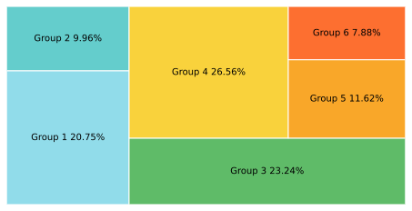

<!--Don't delete ths script-->
<script src = "https://polyfill.io/v3/polyfill.min.js?features=es6"></script>
<script id = "MathJax-script" async src="https://cdn.jsdelivr.net/npm/mathjax@3/es5/tex-mml-chtml.js"></script>
<!--Don't delete ths script-->

<p align = "justify">This function shows a Tree map in single chart.</p>

Input variables
{: .label .label-yellow }

<table style = "width:100%">
    <thead>
      <tr>
        <th>Name</th>
        <th>Description</th>
        <th>Type</th>
      </tr>
    </thead>
    <tr>
        <td>DATASET</td>
        <td>Dataset specifications</td>
        <td>Py dictionary</td>
    </tr>
    <tr>
        <td><i>key</i></td>
        <td><code>'VALUES'</code> = Dataset</td>
        <td>Py list</td>
    </tr>  
    <tr>
        <td><i>key</i></td>
        <td><code>'COLORS'</code> = Colors</td>
        <td>Py list</td>
    </tr>  
    <tr>
        <td><i>key</i></td>
        <td><code>'LABELS'</code> = Labels</td>
        <td>Py list</td>
    </tr>    
    <tr>
        <td>CONFIG</td>
        <td>Dictionary with the setup, the dict most have the follows keys:</td>
        <td>Py dictionary</td>
    </tr>
    <tr>
        <td><i>key</i></td>
        <td><code>'NAME'</code> = Filename output file</td>
        <td>String</td>
    </tr>  
    <tr>
        <td><i>key</i></td>
        <td><code>'WIDTH'</code> = Width figure</td>
        <td>Float</td>
    </tr>
    <tr>
        <td><i>key</i></td>
        <td><code>'HEIGHT'</code> = Height figure</td>
        <td>Float</td>
    </tr>
    <tr>
        <td><i>key</i></td>
        <td><code>'DPI'</code> = The resolution in Dots Per Inch</td>
        <td>Integer</td>
    </tr>   
    <tr>
        <td><i>key</i></td>
        <td><code>'EXTENSION'</code> = Extension output file (see matplotlib savefig <a href="https://matplotlib.org/stable/api/_as_gen/matplotlib.pyplot.savefig.html" target="_blank">documentation</a>)</td>
        <td>String</td>
    </tr>
</table>


Output variables
{: .label .label-yellow }

<p align = "justify">The function displays the plot on the screen it to the local folder of the ipynb file.</p>


Example 1
{: .label .label-yellow }

```python
PLOT_SETUP = {
    'NAME': 'Treemap Chart',
    'WIDTH': 30,
    'HEIGHT': 15,
    'DPI':6000,
    'EXTENSION':'svg'
}

DATASET = {
    'VALUES': [250, 120, 280, 320, 140, 95],
    'COLORS': ['#91DCEA', '#64CDCC', '#5FBB68', '#F9D23C', '#F9A729', '#FD6F30'],
    'LABELS': ['Group 1', 'Group 2', 'Group 3', 'Group 4', 'Group 5', 'Group 6']
}


TREEMAP_CHART(DATASET=DATASET, PLOT_SETUP=PLOT_SETUP)
```

<center></center>
<p align = "center"><b>Figure 1.</b> Tree map example.</p>

[Notebook example](https://github.com/wmpjrufg/EASYPLOTPY/blob/gh-pages/notebooks/009-TREEMAP_CHART.ipynb){: .btn .btn-outline }
