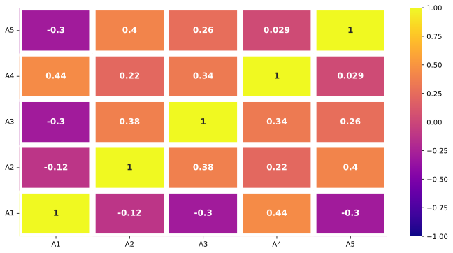

<!-- ---
title: Tree map
layout: home
nav_order: 7
parent: Charts
--- -->

<!--Don't delete ths script-->
<script src = "https://polyfill.io/v3/polyfill.min.js?features=es6"></script>
<script id = "MathJax-script" async src="https://cdn.jsdelivr.net/npm/mathjax@3/es5/tex-mml-chtml.js"></script>
<!--Don't delete ths script-->

<p align = "justify">This function shows a Heatmap correlation plot in single chart.</p>

Input variables
{: .label .label-yellow }

<table style = "width:100%">
    <thead>
      <tr>
        <th>Name</th>
        <th>Description</th>
        <th>Type</th>
      </tr>
    </thead>
    <tr>
        <td>DATASET</td>
        <td>Dataset specifications</td>
        <td>Py dictionary</td>
    </tr>
    <tr>
        <td><i>key</i></td>
        <td><code>'DATASET'</code> = Full dataset</td>
        <td>Py dataframe</td>
    </tr> 
    <tr>
        <td>PLOT_SETUP</td>
        <td>Specifications of chart</td>
        <td>Py dictionary</td>
    </tr>  
    <tr>
        <td><i>key</i></td>
        <td><code>'NAME'</code> = Filename output file</td>
        <td>String</td>
    </tr>  
    <tr>
        <td><i>key</i></td>
        <td><code>'WIDTH'</code> = Width figure in centimeters</td>
        <td>Float</td>
    </tr>
    <tr>
        <td><i>key</i></td>
        <td><code>'HEIGHT'</code> = Height figure in centimeters</td>
        <td>Float</td>
    </tr> 
    <tr>
        <td><i>key</i></td>
        <td><code>'MASK'</code> = Generate a mask for the upper triangle</td>
        <td>Boolean (<code>True</code> or <code>False</code>)</td>
    </tr>
    <tr>
        <td><i>key</i></td>
        <td><code>'LINE WIDTHS'</code> = Spacing between each block</td>
        <td>Integer</td>
    </tr>
    <tr>
        <td><i>key</i></td>
        <td><code>'CMAP COLOR'</code> = Colobar (see matplotlib <a href="https://matplotlib.org/stable/tutorials/colors/colormaps.html" target="_blank">documentation</a>)</td>
        <td>Boolean (<code>True</code> or <code>False</code>) or String</td>
    </tr>
    <tr>
        <td><i>key</i></td>
        <td><code>'LINE COLOR'</code> = Color line between each block</td>
        <td>String</td>
    </tr>
    <tr>
        <td><i>key</i></td>
        <td><code>'ANNOT'</code> = Annotations into the heatmap</td>
        <td>Boolean (<code>True</code> or <code>False</code>) or String</td>
    </tr>
    <tr>
        <td><i>key</i></td>
        <td><code>'ANNOT SIZE FONT'</code> = Annotation font</td>
        <td>Integer</td>
    </tr> 
    <tr>
        <td><i>key</i></td>
        <td><code>'DPI'</code> = The resolution in Dots Per Inch</td>
        <td>Integer</td>
    </tr>   
    <tr>
        <td><i>key</i></td>
        <td><code>'EXTENSION'</code> = Extension output file (see matplotlib <a href="https://matplotlib.org/stable/api/_as_gen/matplotlib.pyplot.savefig.html" target="_blank">documentation</a>)</td>
        <td>String</td>
    </tr>
</table>

Output variables
{: .label .label-yellow }

<p align = "justify">The function displays the plot on the screen and saves it to the local folder of the <code>.ipynb</code> / <code>.py</code> file.</p>

Example 1
{: .label .label-blue }

<p align = "justify">We use the <code>HEATMAP_CHART</code> function to plot a correlation scores about machine learning features.</p>

```python
# Data
DF = pd.DataFrame({ 'A1': [random.randint(1, 100) for _ in range(10)],
                    'A2': [random.randint(1, 100) for _ in range(10)],
                    'A3': [random.randint(1, 100) for _ in range(10)],
                    'A4': [random.randint(1, 100) for _ in range(10)],
                    'A5': [random.randint(1, 100) for _ in range(10)]
                  })

# Chart setup
PLOT_SETUP = {
              'NAME': 'figure1-7-1',
              'WIDTH': 30, 
              'HEIGHT': 15,
              'MASK': False,
              'LINE WIDTHS': 8,
              'CMAP COLOR': 'plasma',
              'LINE COLOR': 'white',
              'ANNOT': True,
              'ANNOT SIZE FONT': 12,
              'DPI': 600, 
              'EXTENSION': 'svg'
             }

# Data statement 
DATA = {'DATASET': DF}

# Call function
HEATMAP_CHART(DATASET = DATA, PLOT_SETUP = PLOT_SETUP)
```
<center></center>
<p align = "center"><b>Figure 1.</b> Machine learning scores.</p>

[Notebook example](https://drive.google.com/file/d/1rWNvKctWb-pii1ZdUh-PXwXBoChFpvla/view?usp=sharing){: .btn .btn-outline }