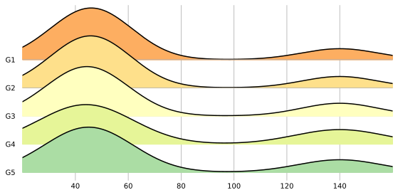

<!--Don't delete ths script-->
<script src = "https://polyfill.io/v3/polyfill.min.js?features=es6"></script>
<script id = "MathJax-script" async src="https://cdn.jsdelivr.net/npm/mathjax@3/es5/tex-mml-chtml.js"></script>
<!--Don't delete ths script-->

<p align = "justify">This function shows a Joy chart.</p>

<h2>Input variables </h2>
<table style = "width:100%">
 <thead>
        <tr>
            <td>CONFIG</td>
            <td>Dictionary with the setup, the dict most have the follows keys:</td>
            <td>Py dictionary</td>
        </tr>
    </thead>
    <tr>
        <td><i>key</i></td>
        <td><code>'NAME'</code> = Filename output file</td>
        <td>String</td>
    </tr>  
    <tr>
        <td><i>key</i></td>
        <td><code>'WIDTH'</code> = Width figure</td>
        <td>Float</td>
    </tr>
    <tr>
        <td><i>key</i></td>
        <td><code>'HEIGHT'</code> = Height figure</td>
        <td>Float</td>
    </tr>
    <tr>
        <td><i>key</i></td>
        <td><code>'DPI'</code> = The resolution in Dots Per Inch</td>
        <td>Integer</td>
    </tr>   
    <tr>
        <td><i>key</i></td>
        <td><code>'EXTENSION'</code> = Extension output file (see matplotlib savefig <a href="https://matplotlib.org/stable/api/_as_gen/matplotlib.pyplot.savefig.html" target="_blank">documentation</a>)</td>
        <td>String</td>
    </tr>
    <tr>
        <td><i>key</i></td>
        <td><code>'K'</code> = An integer defining the length of the returned list</td>
        <td>String</td>
    </tr>
          
   <tr>
        <td>DATASET</td>
        <td>Dataset specifications</td>
        <td>Py dictionary</td>
    </tr>
    <tr>
        <td><i>key</i></td>
        <td><code>'VALUES'</code> = Dataset</td>
        <td>Py list</td>
    </tr>  
    <tr>
        <td><i>key</i></td>
        <td><code>'COLORS'</code> = Colors</td>
        <td>Py list</td>
    </tr>  
    <tr>
        <td><i>key</i></td>
        <td><code>'LABELS'</code> = Labels</td>
        <td>Py list</td>
    </tr>
    
</table>

<h2>Output variables</h2>

<p align = "justify">The function displays the plot on the screen it to the local folder of the ipynb file.</p>

<h2>Example 1</h2>

```python
from EASYPLOT_TOOLBOX import *

config = {
    'NAME': 'Join Histogram Chart',
    'WIDTH': 20,
    'HEIGHT': 10,
    'DPI':600,
    'EXTENSION':'svg',
    'K': 500
}

dataset = {
    'LABELS': ["G1", "G2", "G3", "G4", "G5"],
    'VALUES': [40, 50, 140, 50, 40],
    'COLORS': ["#FDAE61", "#FEE08B", "#FFFFBF", "#E6F598", "#ABDDA4"]
}


JOIN_HIST_CHART(CONFIG=config, DATASET=dataset)
```

<center></center>
<p align = "center"><b>Figure 1.</b> Joy chart example.</p>

[Notebook example](https://github.com/wmpjrufg/EASYPLOTPY/blob/gh-pages/notebooks/010-JOIN_HIST_CHART.ipynb){: .btn .btn-outline }