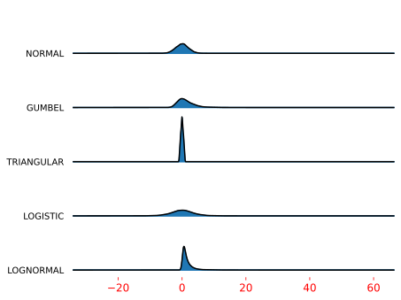

<!--Don't delete ths script-->
<script src = "https://polyfill.io/v3/polyfill.min.js?features=es6"></script>
<script id = "MathJax-script" async src="https://cdn.jsdelivr.net/npm/mathjax@3/es5/tex-mml-chtml.js"></script>
<!--Don't delete ths script-->

<p align = "justify">This function shows a Multiple histograms in single chart.</p>

Input variables
{: .label .label-yellow }

<table style = "width:100%">
   <thead>
      <tr>
        <th>Name</th>
        <th>Description</th>
        <th>Type</th>
      </tr>
    </thead>
    <tr>
        <td>DATASET</td>
        <td>Dataset specifications</td>
        <td>Py dictionary</td>
    </tr>
    <tr>
        <td><i>key</i></td>
        <td><code>'DATASET'</code> = Full dataset</td>
        <td>Py dataframe</td>
    </tr> 
    <tr>
        <td>PLOT_SETUP</td>
        <td>Specifications of chart</td>
        <td>Py dictionary</td>
    </tr>  
    <tr>
        <td><i>key</i></td>
        <td><code>'NAME'</code> = Filename output file</td>
        <td>String</td>
    </tr>  
    <tr>
        <td><i>key</i></td>
        <td><code>'WIDTH'</code> = Width figure in centimeters</td>
        <td>Float</td>
    </tr>
    <tr>
        <td><i>key</i></td>
        <td><code>'HEIGHT'</code> = Height figure in centimeters</td>
        <td>Float</td>
    </tr> 
    <tr>
        <td><i>key</i></td>
        <td><code>'X AXIS SIZE'</code> = \(x\) font axis size</td>
        <td>Float</td>
    </tr>
    <tr>
        <td><i>key</i></td>
        <td><code>'X AXIS COLOR'</code> = \(x\) axis color</td>
        <td>Float</td>
    </tr>
    <tr>
        <td><i>key</i></td>
        <td><code>'DPI'</code> = The resolution in Dots Per Inch</td>
        <td>Integer</td>
    </tr>   
    <tr>
        <td><i>key</i></td>
        <td><code>'EXTENSION'</code> = Extension output file (see matplotlib <a href="https://matplotlib.org/stable/api/_as_gen/matplotlib.pyplot.savefig.html" target="_blank">documentation</a>)</td>
        <td>String</td>
    </tr>
</table>

Output variables
{: .label .label-yellow }

<p align = "justify">The function displays the plot on the screen and saves it to the local folder of the <code>.ipynb</code> / <code>.py</code> file.</p>

Example 1
{: .label .label-blue }

<p align = "justify">We use the <code>JOIN_HIST_CHART</code> function to plot a five probability distribuitions.</p>

```python
# Data
N = 10000
DF = pd.DataFrame({'normal': np.random.normal(0, 2, N),
                    'gumbel': np.random.gumbel(0, 2, N),
                    'triangular': np.random.triangular(-1, 0, 1, N),
                    'logistic': np.random.logistic(0, 2, N),
                    'lognormal': np.random.lognormal(0, 1, N)})

# Chart setup
PLOT_SETUP = {
    'NAME': 'figure1-9-1',
    'WIDTH': 20,
    'HEIGHT': 20,
    'X AXIS SIZE': 12,
    'X AXIS COLOR': 'red',
    'DPI':600,
    'EXTENSION':'svg'
}

# Data statement 
DATA = {'DATASET': DF}

# Call function
JOIN_HIST_CHART(DATASET = DATA, PLOT_SETUP = PLOT_SETUP)
```

<center></center>
<p align = "center"><b>Figure 1.</b> Joy chart example.</p>

[Notebook example](https://drive.google.com/file/d/1uqUoxjKcnK5OW7Iv-39sP0z_uFJrzGak/view?usp=sharing){: .btn .btn-outline }