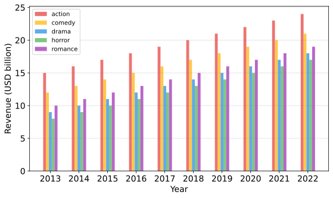

<h3>bar_chart</h3>

<br>

<p align = "justify">
    This function creates a bar chart.


</p>

```python
bar_chart(**kwargs)
```

Input variables
{: .label .label-yellow }

<table style="width:100%">
    <thead>
        <tr>
            <th>Name</th>
            <th>Description</th>
            <th>Type</th>
        </tr>
    </thead>
    <tbody>
        <tr>
            <td><code>plot_setup</code></td>
            <td>
                <p align="justify">Setup chart Dictionary with the following keys:</p>
                <ul>
                    <li><code>name</code>: Path + name of the figure</li>
                    <li><code>width</code>: Figure width in SI units</li>
                    <li><code>height</code>: Figure height in SI units</li>
                    <li><code>extension</code>: File extension</li>
                    <li><code>dots_per_inch</code>: The resolution in dots per inch</li>
                    <li><code>y_axis_label</code>: y axis label</li>
                    <li><code>x_axis_label</code>: x axis label</li>
                    <li><code>labels_size</code>: Labels size</li>
                    <li><code>labels_color</code>: Labels color</li>
                    <li><code>x_axis_size</code>: x axis size</li>
                    <li><code>y_axis_size</code>: y axis size</li>
                    <li><code>axises_color</code>: Axes color</li>
                    <li><code>on_grid</code>: Grid on or off</li>
                    <li><code>y_log</code>: y log scale</li>
                    <li><code>x_log</code>: x log scale</li>
                    <li><code>colors</code>: List of colors for the bars</li>
                    <li><code>opacity</code>: Opacity of the bars</li>
                </ul>
            </td>
            <td>Dictionary</td>
        </tr>
        <tr>
            <td><code>dataset</code></td>
            <td>
                <p align="justify">Dataset to plot</p>
            </td>
            <td>List or array</td>
        </tr>
    </tbody>
</table>


Output variables
{: .label .label-yellow }

<table style = "width:100%">
    <thead>
      <tr>
        <th>Name</th>
        <th>Description</th>
        <th>Type</th>
      </tr>
    </thead>
    <tr>
        <td><code>None</code></td>
        <td>The function displays the plot on the screen and saves it to the local folder of the <code>.ipynb</code> or <code>.py</code> </td>
        <td>None</td>
    </tr>
</table>

Example 1
{: .label .label-blue }

<p align = "justify">
    <i>
        Use the <code>bar_chart</code> function to perform a task.
    </i>
</p>

```python
# Data
df = pd.DataFrame({'x': ['2013', '2014', '2015', '2016', '2017', '2018', '2019', '2020', '2021', '2022'],
                   'action': [15.00, 16.00, 17.00, 18.00, 19.00, 20.00, 21.00, 22.00, 23.00, 24.00],
                   'comedy': [12.00, 13.00, 14.00, 15.00, 16.00, 17.00, 18.00, 19.00, 20.00, 21.00],
                   'drama': [9.00, 10.00, 11.00, 12.00, 13.00, 14.00, 15.00, 16.00, 17.00, 18.00],
                   'horror': [8.00, 9.00, 10.00, 11.00, 12.00, 13.00, 14.00, 15.00, 16.00, 17.00],
                   'romance': [10.00, 11.00, 12.00, 13.00, 14.00, 15.00, 16.00, 17.00, 18.00, 19.00]
                  })

# Chart setup  
chart_config = {
    'name': 'figure1-4-1',
    'width': 20,
    'height': 12,
    'bar width': .10,
    'opacity': 0.7,
    'y axis label': 'Revenue (USD billion)',
    'y axis size': 14,
    'x axis label': 'Year',
    'x axis size': 14,
    'axes color': 'green',
    'labels size': 14,
    'labels color': 'blue',
    'colors': ['#E53935', '#FFB300', '#1E88E5', '#4CAF50', '#9C27B0'],
    'on grid?': True,
    'y log': False,
    'dots per inch': 600,
    'extension': 'svg',
}

# Data statement 
data = {'dataset': df}

# Call function
bar_chart(dataset=data, plot_setup=chart_config)
```

<center></center>
<p align = "center"><b>Figure 1.</b> Film Revenue by Category and Year.</p>

[Notebook example](https://drive.google.com/file/d/1rf2oZHfnTU4MBpZyqr25tsnUi26uwgd3/view?usp=sharing){: .btn .btn-outline }

