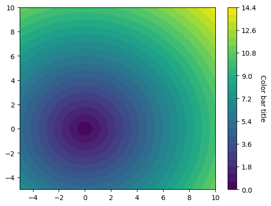

<h3>contour_chart</h3>

<br>

<p align="justify">
    This function creates a filled contour plot using matplotlib.

</p>

```python
contour_chart(dataset, plot_setup)
```

<h3>Input Variables</h3>
{: .label .label-yellow }

<table style="width:100%;">
    <thead>
        <tr>
            <th>Name</th>
            <th>Description</th>
            <th>Type</th>
        </tr>
    </thead>
    <tbody>
        <tr>
            <td><code>plot_setup</code></td>
            <td>
                <p align="justify">Dictionary containing the data to plot. Must include:</p>
                <ul>
                    <li><code>X</code>: Array-like object of x-coordinates</li>
                    <li><code>Y</code>: Array-like object of y-coordinates</li>
                    <li><code>Z</code>: Array-like object of z-values</li>
                </ul>
            </td>
            <td>Dictionary</td>
        </tr>
        <tr>
            <td><code>dataset</code></td>
            <td>
                <p align="justify">Array or list containing the dataset values to plot</p>
            </td>
            <td>List or Array</td>
        </tr>
    </tbody>
</table>

<h3>Output Variables</h3>
{: .label .label-yellow }

<table style="width:100%;">
    <thead>
        <tr>
            <th>Name</th>
            <th>Description</th>
            <th>Type</th>
        </tr>
    </thead>
    <tbody>
        <tr>
            <td><code>None</code></td>
            <td>
                <p align="justify">The function displays the contour plot on the screen and saves it to the local folder of the <code>.ipynb</code> or <code>.py</code> file.</p>
            </td>
            <td>None</td>
        </tr>
    </tbody>
</table>

Example 1
{: .label .label-blue }

<p align="justify">
    <i>
        Use the <code>contour_chart</code> function to create a filled contour plot.
    </i>
</p>

```python
# Data
X, Y = np.meshgrid(np.linspace(-5, 10, 100),
                   np.linspace(-5, 10, 100))
Z = np.sqrt(X ** 2 + Y ** 2)

setup = {
    'NAME': 'CONTOUR',         
    'DPI': 600, 
    'EXTENSION': 'svg',
    'TITLE': 'Color bar title',
    'LEVELS': 25
}
dataset = {
    'X': X,
    'Y': Y,
    'Z': Z
}
contour_chart(DATASET=dataset, PLOT_SETUP=setup)
```

<center></center>
<p align="center"><b>Figure 1.</b> Filled Contour Plot.</p>

[Notebook example](https://drive.google.com/file/d/1rf2oZHfnTU4MBpZyqr25tsnUi26uwgd3/view?usp=sharing){: .btn .btn-outline }
