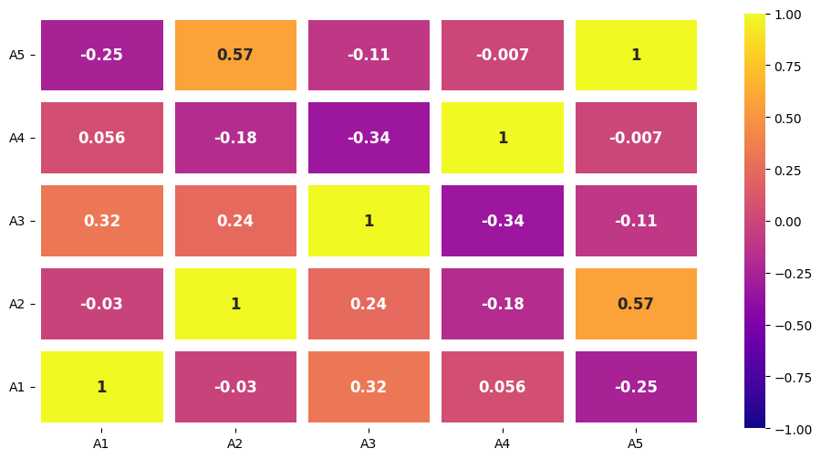

<h3>heatmap_chart</h3>

<br>

<p align = "justify">
    This function creates a heatmap chart.
</p>

```python
heatmap_chart(**kwargs)
```

Input variables  
{: .label .label-yellow }

<table style = "width:100%">
    <thead>
      <tr>
        <th>Name</th>
        <th>Description</th>
        <th>Type</th>
      </tr>
    </thead>
    <tr>
        <td><code>plot_setup</code></td>
        <td><p align="justify">Setup chart Dictionary with the following keys:</p></td>
        <td>Dictionary</td>
    </tr>
    <tr>
        <td><code>name</code></td>
        <td><p align="justify">Path + name figure (key required in plot_setup)</p></td>
        <td>String</td>
    </tr>
    <tr>
        <td><code>width</code></td>
        <td><p align="justify">Figure width in SI units (key required in plot_setup)</p></td>
        <td>Float</td>
    </tr>
    <tr>
        <td><code>height</code></td>
        <td><p align="justify">Figure height in SI units (key required in plot_setup)</p></td>
        <td>Float</td>
    </tr>
    <tr>
        <td><code>extension</code></td>
        <td><p align="justify">File extension (key required in plot_setup)</p></td>
        <td>String</td>
    </tr>
    <tr>
        <td><code>dots_per_inch</code></td>
        <td><p align="justify">The resolution in dots per inch (key required in plot_setup)</p></td>
        <td>Integer</td>
    </tr>
    <tr>
        <td><code>mask</code></td>
        <td><p align="justify">Whether to use a mask for the upper triangle (key required in plot_setup)</p></td>
        <td>Boolean</td>
    </tr>
    <tr>
        <td><code>line_widths</code></td>
        <td><p align="justify">Width of the lines between cells (key required in plot_setup)</p></td>
        <td>Float</td>
    </tr>
    <tr>
        <td><code>color map</code></td>
        <td><p align="justify">Color map for the heatmap (key required in plot_setup)</p></td>
        <td>String or List</td>
    </tr>
    <tr>
        <td><code>line color</code></td>
        <td><p align="justify">Color of the lines between cells (key required in plot_setup)</p></td>
        <td>String</td>
    </tr>
    <tr>
        <td><code>annot</code></td>
        <td><p align="justify">Whether to annotate each cell with the correlation value (key required in plot_setup)</p></td>
        <td>Boolean</td>
    </tr>
    <tr>
        <td><code>annot size font</code></td>
        <td><p align="justify">Font size of the annotations (key required in plot_setup)</p></td>
        <td>Integer</td>
    </tr>
</table>

Output variables  
{: .label .label-yellow }

<table style = "width:100%">
    <thead>
      <tr>
        <th>Name</th>
        <th>Description</th>
        <th>Type</th>
      </tr>
    </thead>
    <tr>
        <td><code>None</code></td>
        <td>The function displays the heatmap on the screen and saves it to the local folder of the <code>.ipynb</code> or <code>.py</code></td>
        <td>None</td>
    </tr>
    </table>

Example 1  
{: .label .label-blue }

<p align = "justify">
    <i>
        Use the <code>heatmap_chart</code> function to generate a heatmap.
    </i>
</p>

```python
# Data
DF = pd.DataFrame({ 'A1': [random.randint(1, 100) for _ in range(10)],
                    'A2': [random.randint(1, 100) for _ in range(10)],
                    'A3': [random.randint(1, 100) for _ in range(10)],
                    'A4': [random.randint(1, 100) for _ in range(10)],
                    'A5': [random.randint(1, 100) for _ in range(10)]
                  })

# Chart setup
plot_setup = {
    'name': 'figure1-7-1',
    'width': 30,
    'height': 15,
    'mask': False,
    'line widths': 8,
    'color map': 'plasma',
    'line color': 'white',
    'annot': True,
    'annot size font': 12,
    'dots per inch': 600,
    'extension': 'svg'
}


# Data statement 
DATA = {'dataset': DF}

# Call function
heatmap_chart(dataset = DATA, plot_setup = plot_setup)
```

<center></center>
<p align = "center"><b>Figure 1.</b> Heatmap of DataFrame Correlation.</p> 
