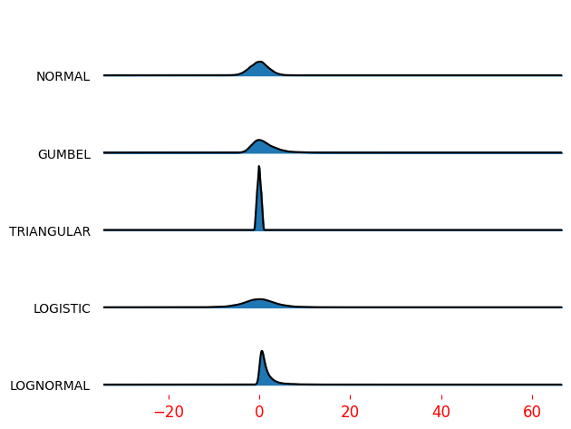

<h3>join_hist_chart</h3>

<br>

<p align="justify">
    This function creates a joyplot (also known as a stacked density plot) using matplotlib and joypy.

</p>

```python
join_hist_chart(**kwargs)
```

Input variables
{: .label .label-yellow }

<table style="width:100%">
    <thead>
      <tr>
        <th>Name</th>
        <th>Description</th>
        <th>Type</th>
      </tr>
    </thead>
    <tr>
        <td><code>dataset</code></td>
        <td>
            <p align="justify">Dictionary containing the data to plot. Must include:</p>
            <ul>
                <li><code>dataset</code>: DataFrame with the data to be plotted</li>
            </ul>
        </td>
        <td>Dictionary</td>
    </tr>
    <tr>
        <td><code>plot_setup</code></td>
        <td>
            <p align="justify">Setup chart Dictionary with the following keys:</p>
            <ul>
                <li><code>name</code>: Path + name of the figure</li>
                <li><code>width</code>: Width of the plot</li>
                <li><code>height</code>: Height of the plot</li>
                <li><code>x_axis_size</code>: Font size for the x-axis labels</li>
                <li><code>X axIS color</code>: Color of the x-axis and y-axis labels</li>
                <li><code>dots_per_inch</code>: Resolution in dots per inch</li>
                <li><code>extension</code>: File extension</li>
        </td>
        <td>Dictionary</td>
    </tr>
        <tr>
            <td><code>dataset</code></td>
            <td>
                <p align="justify">Dataset to plot</p>
            </td>
            <td>List or array</td>
        </tr>
</table>

Output variables
{: .label .label-yellow }

<table style="width:100%">
    <thead>
      <tr>
        <th>Name</th>
        <th>Description</th>
        <th>Type</th>
      </tr>
    </thead>
    <tr>
        <td><code>None</code></td>
        <td>The function displays the joyplot on the screen and saves it to the local folder of the <code>.ipynb</code> or <code>.py</code></td>
        <td>None</td>
    </tr>
</table>

Example 1
{: .label .label-blue }

<p align="justify">
    <i>
        Use the <code>join_hist_chart</code> function to create a joyplot of the dataset.
    </i>
</p>

```python
# Data
import pandas as pd
import numpy as np

# Generating sample data
np.random.seed(0)
data = pd.DataFrame({
    'A': np.random.normal(loc=0, scale=1, size=100),
    'B': np.random.normal(loc=1, scale=2, size=100),
    'C': np.random.normal(loc=2, scale=3, size=100),
})

# Chart setup
chart_config = {
    'name': 'joyplot',
    'width': 10,
    'height': 6,
    'x_axis_size': 12,
    'X axIS color': 'black',
    'dots_per_inch': 300,
    'extension': 'png',
}

# Call function
join_hist_chart(dataset={'dataset': data}, plot_setup=chart_config)
```

<center></center>
<p align="center"><b>Figure 1.</b> Joyplot of the dataset.</p>

[Notebook example](https://drive.google.com/file/d/1rf2oZHfnTU4MBpZyqr25tsnUi26uwgd3/view?usp=sharing){: .btn .btn-outline }