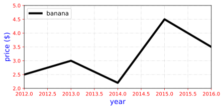
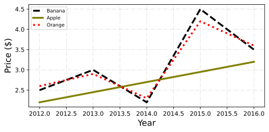

<h3>line_chart</h3>

<br>

<p align = "justify">
    This function shows a multiple lines in single chart.
</p>

```python
line_chart(**kwargs)
```

Input variables
{: .label .label-yellow }

<table style="width:100%">
    <thead>
        <tr>
            <th>Name</th>
            <th>Description</th>
            <th>Type</th>
        </tr>
    </thead>
    <tbody>
        <tr>
            <td><code>plot_setup</code></td>
            <td>
                <p align="justify">Settings of chart (Dictionary with the following keys):</p>
                <ul>
                    <li><code>name</code>: Path + name of the figure</li>
                    <li><code>width</code>: Figure width in SI units</li>
                    <li><code>height</code>: Figure height in SI units</li>
                    <li><code>extension</code>: File extension</li>
                    <li><code>dots_per_inch</code>: Resolution in dots per inch</li>
                    <li><code>marker</code>: List of markers. See <a href="https://matplotlib.org/stable/gallery/lines_bars_and_markers/marker_reference.html#sphx-glr-gallery-lines-bars-and-markers-marker-reference-py" target="_blank">gallery</a></li>
                    <li><code>marker_size</code>: List of marker sizes</li>
                    <li><code>line_width</code>: List of line widths</li>
                    <li><code>line_style</code>: List of line styles. See <a href="https://matplotlib.org/stable/gallery/lines_bars_and_markers/linestyles.html" target="_blank">gallery</a></li>
                    <li><code>x_axis_label</code>: x axis label</li>
                    <li><code>x_axis_size</code>: x axis size</li>
                    <li><code>y_axis_label</code>: y axis label</li>
                    <li><code>y_axis_size</code>: y axis size</li>
                    <li><code>axises_color</code>: Axes color</li>
                    <li><code>labels_size</code>: Labels size</li>
                    <li><code>labels_color</code>: Labels color</li>
                    <li><code>chart_color</code>: Chart color</li>
                    <li><code>x_limit</code>: x axis limits</li>
                    <li><code>y_limit</code>: y axis limits</li>
                    <li><code>on_grid</code>: Grid on or off</li>
                    <li><code>y_log</code>: y log scale</li>
                    <li><code>x_log</code>: x log scale</li>
                    <li><code>legend</code>: List of legends</li>
                    <li><code>legend_location</code>: Legend location</li>
                    <li><code>size_legend</code>: Legend size</li>
                </ul>
            </td>
            <td>Dictionary</td>
        </tr>
        <tr>
            <td><code>dataset</code></td>
            <td>
                <p align="justify">Dataset to plot</p>
            </td>
            <td>List or array</td>
        </tr>
    </tbody>
</table>


Output variables
{: .label .label-yellow }

<table style = "width:100%">
    <thead>
      <tr>
        <th>Name</th>
        <th>Description</th>
        <th>Type</th>
      </tr>
    </thead>
    <tr>
        <td><code>None</code></td>
        <td>The function displays the plot on the screen and saves it to the local folder of the <code>.ipynb</code> or <code>.py</code> </td>
        <td>None</td>
    </tr>
</table>

Example 1
{: .label .label-blue }

<p align = "justify">
    <i>
        We use the <code>line_chart</code> function to plot a series of banana prices.
    </i>
</p>

```python
# Data
df =  {
        'x0': [2012, 2013, 2014, 2015, 2016],
        'y0': [2.50, 3.00, 2.20, 4.50, 3.50]
      }

# Chart setup
chart_config = {
                'name': 'figure_021_line_chart',
                'width': 16.0, 
                'height': 8.0,
                'extension': 'svg',
                'dots_per_inch': 600, 
                'marker': [None],
                'marker_size': [20],
                'line_width': [4],
                'line_style': ['-'],
                'x_axis_label': 'year',
                'x_axis_size': 10,
                'y_axis_label': 'price ($)',
                'y_axis_size': 10,
                'axises_color': 'red',
                'labels_size': 14,
                'labels_color': 'blue',
                'chart_color': ['#000000'],
                'on_grid': True,
                'legend': ['banana'], # or without legend 'legend': [none]
                'legend_location': 'upper left',
                'x_limit': [2012, 2016],
                'y_limit': [2, 5.00],
                'size_legend': 12,
                'y_log': False,
                'x_log': False,
            }

# Call function
line_chart(dataset=df, plot_setup=chart_config)
```

<center>
    
    <p align="center"><b>Figure 1.</b> Line chart</p>
</center>


Example 2
{: .label .label-blue }

<p align = "justify">
    <i>
        We use the <code>line_chart</code> function to plot a series of fruit prices.
    </i>
</p>

```python
# Data statement 
df =  {
        'x0': [2012, 2013, 2014, 2015, 2016],
        'y0': [2.5, 3.0, 2.2, 4.5, 3.5],
        'x1': [2012, 2016],
        'y1': [2.2, 3.2],
        'x2': [2012, 2013, 2014, 2015, 2016],
        'y2': [2.6, 2.9, 2.3, 4.2, 3.6]
       }

# Chart setup
chart_config = {
                'name': 'figure_022_line_chart',
                'width': 16.0, 
                'height': 8.0,
                'extension': 'svg',
                'dots_per_inch': 600, 
                'marker': [None, None, None],
                'marker_size': [3, 3, 3],
                'line_width': [3, 3, 3],
                'line_style': ['--', '-', 'dotted'],
                'x_axis_label': 'Year',
                'x_axis_size': 10,
                'y_axis_label': 'Price ($)',
                'y_axis_size': 10,
                'axises_color': '#000000',
                'labels_size': 14,
                'labels_color': '#000000',
                'chart_color': ['#000000','olive','r'],
                'on_grid': True,
                'legend': ['Banana', 'Apple', 'Orange'],
                'legend_location': 'upper left',
                'size_legend': 8,
                'x_limit': None,
                'y_limit': None,
                'y_log': False,
                'x_log': False,
               }

# Call function
line_chart(dataset=df, plot_setup=chart_config)
```

<center>
    
    <p align="center"><b>Figure 2.</b> Line chart</p>
</center>