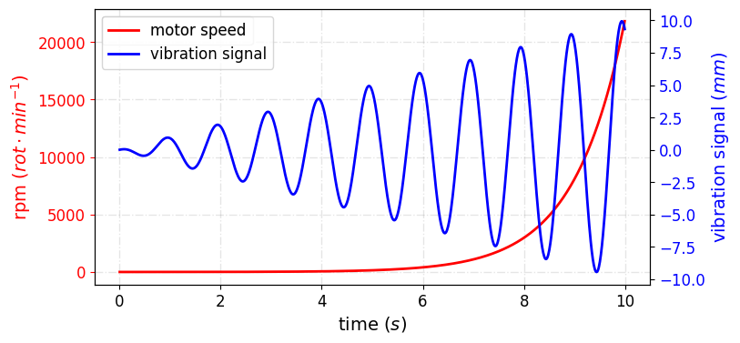

<h3>multiple_lines_chart</h3>

<br>

<p align = "justify">
    This function creates a line chart with two y-axes, allowing for the display of multiple lines with different scales on the same chart.
</p>

```python
multiple_lines_chart(**kwargs)
```

Input variables
{: .label .label-yellow }

<table style = "width:100%">
    <thead>
      <tr>
        <th>Name</th>
        <th>Description</th>
        <th>Type</th>
      </tr>
    </thead>
    <tr>
        <td><code>plot_setup</code></td>
        <td>
            <p align="justify">Setup chart Dictionary with the following keys:</p>
            <ul>
                <li><code>name</code>: Path + name of the figure</li>
                <li><code>width</code>: Figure width in SI units</li>
                <li><code>height</code>: Figure height in SI units</li>
                <li><code>extension</code>: File extension</li>
                <li><code>dots_per_inch</code>: The resolution in dots per inch</li>
                <li><code>marker</code>: Markers for the lines</li>
                <li><code>marker_size</code>: Size of the markers</li>
                <li><code>line_width</code>: Width of the lines</li>
                <li><code>line_style</code>: Line styles</li>
                <li><code>Y0_axIS_LABEL</code>: Label for the primary y-axis</li>
                <li><code>Y1_axIS_LABEL</code>: Label for the secondary y-axis</li>
                <li><code>x_axis_label</code>: Label for the x-axis</li>
                <li><code>labels_size</code>: Size of the labels</li>
                <li><code>x_axis_size</code>: Size of the x-axis labels</li>
                <li><code>y_axis_size</code>: Size of the y-axis labels</li>
                <li><code>chart_color</code>: List of colors for the lines</li>
                <li><code>on_grid</code>: Grid on or off</li>
                <li><code>y_log</code>: y log scale</li>
                <li><code>x_log</code>: x log scale</li>
                <li><code>legend</code>: Legend labels</li>
                <li><code>legend_location</code>: Location of the legend</li>
                <li><code>size_legend</code>: Font size of the legend</li>
            </ul>
        </td>
        <td>Dictionary</td>
    </tr>
    <tr>
        <td><code>dataset</code></td>
        <td>
            <p align="justify">Dataset to plot</p>
        </td>
        <td>List or array</td>
    </tr>
</table>

Output variables
{: .label .label-yellow }

<table style = "width:100%">
    <thead>
      <tr>
        <th>Name</th>
        <th>Description</th>
        <th>Type</th>
      </tr>
    </thead>
    <tr>
        <td><code>None</code></td>
        <td>The function displays the plot on the screen and saves it to the local folder of the <code>.ipynb</code> or <code>.py</code></td>
        <td>None</td>
    </tr>
</table>

Example 1
{: .label .label-blue }

<p align = "justify">
    <i>
        Use the <code>multiple_lines_chart</code> function to visualize multiple lines with two y-axes.
    </i>
</p>

```python
# Data
X = np.arange(0.01, 10.0, 0.01)
DATA_1 = np.exp(X)
DATA_2 = X * np.sin(2 * np.pi * X + 2)
DF =  pd.DataFrame({
                    'x': list(X),
                    'y0': list(DATA_1),
                    'y1': list(DATA_2)
                   })

# Chart setup
CHART_CONFIG = {
              'NAME': 'figure1-10-1',
              'WIDTH': 20., 
              'HEIGHT': 10,
              'MARKER': ['none', 'none'],
              'MARKER SIZE': 2,
              'LINE WIDTH': 2,
              'LINE STYLE': ['-', '-'],
              'X AXIS LABEL': 'time ($s$)',
              'X AXIS SIZE': 12,
              'Y0 AXIS LABEL': 'rpm ($rot \cdot min^{-1}$)',
              'Y1 AXIS LABEL': 'vibration signal ($mm$)',
              'Y AXIS SIZE': 12,
              'LABELS SIZE': 14,
              'CHART COLOR': ['red', 'blue'],
              'ON GRID?': True,
              'LEGEND': ['motor speed', 'vibration signal'],
              'LOC LEGEND': 'upper left',
              'SIZE LEGEND': 12,
              'Y LOG': False,
              'X LOG': False,
              'DPI': 600, 
              'EXTENSION': 'svg'
             }

# Data statement 
DATA = {'DATASET': DF}

# Call function
multiple_lines_chart(DATASET = DATA, PLOT_SETUP = CHART_CONFIG)
```

<center></center>
<p align = "center"><b>Figure 2.</b> Data Visualization with Two Y-Axes.</p>
```