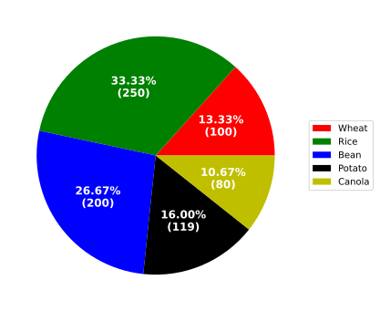

<!-- ---
layout: home
title: pizza_chart
parent: Charts
nav_order: 5
has_toc: false
--- -->

<h3>pizza_chart</h3>

<br>

<p align = "justify">
    This function creates a pie chart.


</p>

```python
pizza_chart(**kwargs)
```

Input variables
{: .label .label-yellow }

<table style = "width:100%">
    <thead>
      <tr>
        <th>Name</th>
        <th>Description</th>
        <th>Type</th>
      </tr>
    </thead>
    <tr>
        <td><code>plot_setup</code></td>
        <td><p align="justify">Setup chart Dictionary with the following keys:</p></td>
        <td>Dictionary</td>
    </tr>
    <tr>
        <td><code>name</code></td>
        <td><p align="justify">Path + name figure (key required in plot_setup)</p></td>
        <td>String</td>
    </tr>
    <tr>
        <td><code>width</code></td>
        <td><p align="justify">Figure width in SI units (key required in plot_setup)</p></td>
        <td>Float</td>
    </tr>
    <tr>
        <td><code>height</code></td>
        <td><p align="justify">Figure height in SI units (key required in plot_setup)</p></td>
        <td>Float</td>
    </tr>
    <tr>
        <td><code>colors</code></td>
        <td><p align="justify">List of colors for the pie slices (key required in plot_setup)</p></td>
        <td>List</td>
    </tr>
    <tr>
        <td><code>size_legend</code></td>
        <td><p align="justify">Font size of the legend (key required in plot_setup)</p></td>
        <td>Integer</td>
    </tr>
    <tr>
        <td><code>dots_per_inch</code></td>
        <td><p align="justify">The resolution in dots per inch (key required in plot_setup)</p></td>
        <td>Integer</td>
    </tr>
    <tr>
        <td><code>extension</code></td>
        <td><p align="justify">File extension (key required in plot_setup)</p></td>
        <td>String</td>
    </tr>
</table>

Output variables
{: .label .label-yellow }

<table style = "width:100%">
    <thead>
      <tr>
        <th>Name</th>
        <th>Description</th>
        <th>Type</th>
      </tr>
    </thead>
    <tr>
        <td><code>None</code></td>
        <td>The function displays the plot on the screen and saves it to the local folder of the <code>.ipynb</code> or <code>.py</code> </td>
        <td>None</td>
    </tr>
</table>

Example 1
{: .label .label-blue }

<p align = "justify">
    <i>
        Use the <code>pizza_chart</code> function to perform a task.
    </i>
</p>

```python
# Data
df = pd.DataFrame({'category': ['Wheat', 'Rice', 'Bean', 'Potato', 'Canola'],
                   'values': [100, 250, 200, 120, 80]
                  })

# Chart setup
chart_config = {
    'name': 'figure1-5-1',
    'width': 15,
    'height': 15,
    'text color': 'w',
    'text font size': 12,
    'size legend': 10,
    'colors': ['r', 'g', 'b', 'black', 'y'],
    'dots per inch': 600,
    'extension': 'svg',
}

# Data statement 
data = {'dataset': df}

# Call function
pizza_chart(dataset=data, plot_setup=chart_config)
```

<center></center>
<p align = "center"><b>Figure 1.</b> Week food consumption.</p>

[Notebook example](https://drive.google.com/file/d/1raCVat5Ahwzh2WATGelMDW6A9YIDjdHW/view?usp=sharing){: .btn .btn-outline }
