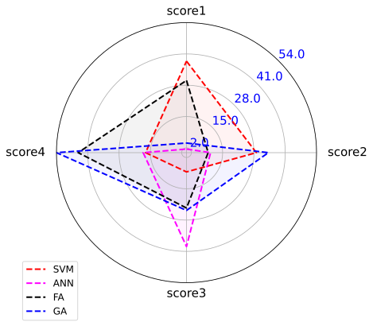

<h3>radar_chart</h3>

<br>

<p align = "justify">
    This function creates a radar chart.


</p>

```python
radar_chart(**kwargs)
```

Input variables
{: .label .label-yellow }

<table style = "width:100%">
    <thead>
      <tr>
        <th>Name</th>
        <th>Description</th>
        <th>Type</th>
      </tr>
    </thead>
    <tr>
        <td><code>plot_setup</code></td>
        <td>
            <p align="justify">Setup chart dictionary with the following keys:</p>
            <ul>
                <li><code>name</code>: Path + name of the figure</li>
                <li><code>width</code>: Figure width in SI units</li>
                <li><code>height</code>: Figure height in SI units</li>
                <li><code>opacity</code>: Opacity of the radar areas</li>
                <li><code>background</code>: Color of the polar background</li>
                <li><code>dots_per_inch</code>: The resolution in dots per inch</li>
                <li><code>extension</code>: File extension</li>
            </ul>
        </td>
        <td>dictionary</td>
    </tr>
    <tr>
        <td><code>dataset</code></td>
        <td>
        <p align="justify">Dataset.</p></td>
        <td>dictionary</td>
</table>

Output variables
{: .label .label-yellow }

<table style = "width:100%">
    <thead>
      <tr>
        <th>Name</th>
        <th>Description</th>
        <th>Type</th>
      </tr>
    </thead>
    <tr>
        <td><code>None</code></td>
        <td>The function displays the plot on the screen and saves it to the local folder of the <code>.ipynb</code> or <code>.py</code> </td>
        <td>None</td>
    </tr>
</table>

Example 1
{: .label .label-blue }

<p align = "justify">
    <i>
        Use the <code>radar_chart</code> function to perform a task.
    </i>
</p>

```python
# Data
df = pd.DataFrame({'group': ['SVM', 'ANN', 'FA', 'GA'],
                   'score1': [38, 1.5, 30, 4],
                   'score2': [29, 10, 9, 34],
                   'score3': [8, 39, 23, 24],
                   'score4': [17, 18, 45, 54]
                  })

# Chart setup
chart_config = {
    'name': 'Figure1-6-1',
    'width': 15,
    'height': 15,
    'text size': 15,
    'div color': "blue",
    'radar color': ['#FF0000', 'magenta', 'black', 'blue'],
    'opacity': 0.05,
    'background': '#9FE2BF',
    'legend size': 12,
    'dots per inch': 600,
    'extension': 'svg',
}

# Data statement 
data = {'dataset': df}

# Call function
radar_chart(dataset=data, plot_setup=chart_config)
```
<center></center>
<p align = "center"><b>Figure 1.</b> Machine learning scores.</p>

[Notebook example](https://drive.google.com/file/d/1r_5ruUQC5iKxJ3C8KHCxUfTxRN3U01bJ/view?usp=sharing){: .btn .btn-outline }
