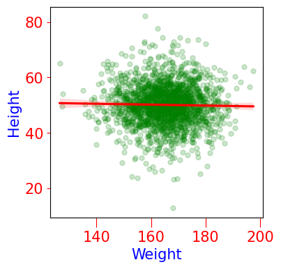

<h3>regplot_chart</h3>

<br>

<p align="justify">
    This function creates a scatter plot with a regression line using seaborn and matplotlib.

</p>

```python
regplot_chart(**kwargs)
```

Input variables
{: .label .label-yellow }

<table style="width:100%">
    <thead>
      <tr>
        <th>Name</th>
        <th>Description</th>
        <th>Type</th>
      </tr>
    </thead>
    <tr>
        <td><code>plot_setup</code></td>
        <td><p align="justify">Setup chart Dictionary with the following keys:</p></td>
        <td>Dictionary</td>
    </tr>
    <tr>
        <td><code>name</code></td>
        <td><p align="justify">Path + name figure (key required in plot_setup)</p></td>
        <td>String</td>
    </tr>
    <tr>
        <td><code>width</code></td>
        <td><p align="justify">Figure width in SI units (key required in plot_setup)</p></td>
        <td>Float</td>
    </tr>
    <tr>
        <td><code>height</code></td>
        <td><p align="justify">Figure height in SI units (key required in plot_setup)</p></td>
        <td>Float</td>
    </tr>
    <tr>
        <td><code>marker_size</code></td>
        <td><p align="justify">Size of the scatter plot markers (key required in plot_setup)</p></td>
        <td>Integer</td>
    </tr>
    <tr>
        <td><code>SCATTER color</code></td>
        <td><p align="justify">Color of the scatter plot markers (key required in plot_setup)</p></td>
        <td>String</td>
    </tr>
    <tr>
        <td><code>line color</code></td>
        <td><p align="justify">Color of the regression line (key required in plot_setup)</p></td>
        <td>String</td>
    </tr>
    <tr>
        <td><code>ORDER</code></td>
        <td><p align="justify">Order of the polynomial regression (key required in plot_setup)</p></td>
        <td>Integer</td>
    </tr>
    <tr>
        <td><code>y_axis_label</code></td>
        <td><p align="justify">y axis label (key required in plot_setup)</p></td>
        <td>String</td>
    </tr>
    <tr>
        <td><code>y_axis_size</code></td>
        <td><p align="justify">y axis size (key required in plot_setup)</p></td>
        <td>Integer</td>
    </tr>
    <tr>
        <td><code>x_axis_label</code></td>
        <td><p align="justify">x axis label (key required in plot_setup)</p></td>
        <td>String</td>
    </tr>
    <tr>
        <td><code>x_axis_size</code></td>
        <td><p align="justify">x axis size (key required in plot_setup)</p></td>
        <td>Integer</td>
    </tr>
    <tr>
        <td><code>labels_size</code></td>
        <td><p align="justify">Labels size (key required in plot_setup)</p></td>
        <td>Integer</td>
    </tr>
    <tr>
        <td><code>labels_color</code></td>
        <td><p align="justify">Labels color (key required in plot_setup)</p></td>
        <td>String</td>
    </tr>
    <tr>
        <td><code>axises_color</code></td>
        <td><p align="justify">Axes color (key required in plot_setup)</p></td>
        <td>String</td>
    </tr>
    <tr>
        <td><code>on_grid</code></td>
        <td><p align="justify">Grid on or off (key required in plot_setup)</p></td>
        <td>Boolean</td>
    </tr>
    <tr>
        <td><code>y_log</code></td>
        <td><p align="justify">y log scale (key required in plot_setup)</p></td>
        <td>Boolean</td>
    </tr>
    <tr>
        <td><code>x_log</code></td>
        <td><p align="justify">x log scale (key required in plot_setup)</p></td>
        <td>Boolean</td>
    </tr>
    <tr>
        <td><code>dots_per_inch</code></td>
        <td><p align="justify">The resolution in dots per inch (key required in plot_setup)</p></td>
        <td>Integer</td>
    </tr>
    <tr>
        <td><code>extension</code></td>
        <td><p align="justify">File extension (key required in plot_setup)</p></td>
        <td>String</td>
    </tr>
</table>

Output variables
{: .label .label-yellow }

<table style="width:100%">
    <thead>
      <tr>
        <th>Name</th>
        <th>Description</th>
        <th>Type</th>
      </tr>
    </thead>
    <tr>
        <td><code>None</code></td>
        <td>The function displays the plot on the screen and saves it to the local folder of the <code>.ipynb</code> or <code>.py</code> </td>
        <td>None</td>
    </tr>
</table>

Example 1
{: .label .label-blue }

<p align="justify">
    <i>
        Use the <code>regplot_chart</code> function to create a scatter plot with a regression line.
    </i>
</p>

```python
# Data
HEIGHT = list(np.random.normal(165, 10, 2000))
WEIGHT = list(np.random.logistic(50, 4, 2000))
DF =  pd.DataFrame({'x': HEIGHT,
                    'y': WEIGHT,
                   })
    
# Chart setup
CHART_CONFIG = {
        'name': 'figure1-11-1',
        'width': 10,
        'height': 10,
        'marker size': 25,
        'SCATTER color': 'green',
        'line color': 'red',
        'ORDER': 1,
        'x axis label': 'Weight',
        'x axis size': 15,
        'y axis label': 'Height',
        'y axis size': 15,
        'axises color': 'red',
        'labels size': 15,
        'labels color': 'blue',
        'on grid?': False,
        'y log': False,
        'x log': False,
        'dots per inch': 600,
        'extension': 'svg',
    }


# Data statement 
DATA = {'dataset': DF}

# Call function
regplot_chart(dataset=DATA, plot_setup=CHART_CONFIG)
```

<center></center>
<p align="center"><b>Figure 1.</b> Scatter Plot with Regression Line.</p>

[Notebook example](https://drive.google.com/file/d/1rf2oZHfnTU4MBpZyqr25tsnUi26uwgd3/view?usp=sharing){: .btn .btn-outline }

