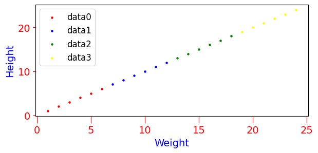

<h3>scatter_chart</h3>

<br>

<p align = "justify">
    This function shows a scatter chart.
</p>

```python
scatter_chart(**kwargs)
```

Input variables
{: .label .label-yellow }

<table style="width:100%">
    <thead>
        <tr>
            <th>Name</th>
            <th>Description</th>
            <th>Type</th>
        </tr>
    </thead>
    <tbody>
        <tr>
            <td><code>plot_setup</code></td>
            <td>
                <p align="justify">Setup chart Dictionary with the following keys:</p>
                <ul>
                    <li><code>name</code>: Path + name of the figure</li>
                    <li><code>width</code>: Figure width in SI units</li>
                    <li><code>height</code>: Figure height in SI units</li>
                    <li><code>extension</code>: File extension</li>
                    <li><code>dots_per_inch</code>: The resolution in dots per inch</li>
                    <li><code>marker_size</code>: List of marker sizes</li>
                    <li><code>y_axis_label</code>: y axis label</li>
                    <li><code>y_axis_size</code>: y axis size</li>
                    <li><code>x_axis_label</code>: x axis label</li>
                    <li><code>x_axis_size</code>: x axis size</li>
                    <li><code>labels_size</code>: Labels size</li>
                    <li><code>labels_color</code>: Labels color</li>
                    <li><code>axises_color</code>: Axes color</li>
                    <li><code>on_grid</code>: Grid on or off</li>
                    <li><code>y_log</code>: y log scale</li>
                    <li><code>x_log</code>: x log scale</li>
                    <li><code>legend</code>: List of legends</li>
                    <li><code>legend_location</code>: Legend location</li>
                    <li><code>size_legend</code>: Legend size</li>
                </ul>
            </td>
            <td>Dictionary</td>
        </tr>
        <tr>
            <td><code>dataset</code></td>
            <td>
                <p align="justify">Dataset. Add key 'colorbar' for colorbar in scatterplot</p>
                <ul>
                    <li><code>x0</code>: x axis values for the first line</li>
                    <li><code>y0</code>: y axis values for the first line</li>
                    <li><code>x1</code>: x axis values for the second line</li>
                    <li><code>y1</code>: y axis values for the second line</li>
                    <li><code>xn</code>: x axis values for the n-th line</li>
                    <li><code>yn</code>: y axis values for the n-th line</li>
                    <li><code>colorbar</code>: List of colorbar values (if colorbar is used in scatterplot)</li>
                </ul>
            </td>
            <td>Dictionary</td>
        </tr>
    </tbody>
</table>


Output variables
{: .label .label-yellow }

<table style = "width:100%">
    <thead>
      <tr>
        <th>Name</th>
        <th>Description</th>
        <th>Type</th>
      </tr>
    </thead>
    <tr>
        <td><code>None</code></td>
        <td>The function displays the plot on the screen and saves it to the local folder of the <code>.ipynb</code> or <code>.py</code> </td>
        <td>None</td>
    </tr>
</table>

Example 1
{: .label .label-blue }

<p align = "justify"><i>We use the <code>scatter_chart</code> function to plot a relationships among height, weight, and age.</i></p>

```python
# Data
df = { 
        'x0': [1, 2, 3, 4, 5, 6],
        'y0': [1, 2, 3, 4, 5, 6],
        'x1': [7, 8, 9, 10, 11, 12],
        'y1': [7, 8, 9, 10, 11, 12],
        'x2': [13, 14, 15, 16, 17, 18],
        'y2': [13, 14, 15, 16, 17, 18],
        'x3': [19, 20, 21, 22, 23, 24],
        'y3': [19, 20, 21, 22, 23, 24],
     }

# Chart setup
chart_config = {
                'name': 'figure1-3-1',
                'width': 16., 
                'height': 8.0,
                'dots_per_inch': 600, 
                'extension': 'svg',
                'marker_size': 50,
                'color_map': ['red', 'blue', 'green', 'yellow'],
                'x_axis_label': 'Weight',
                'x_axis_size': 14,
                'y_axis_label': 'Height',
                'y_axis_size': 14,
                'axises_color': 'red', 
                'labels_size': 14,
                'labels_color': 'blue',
                'on_grid': False,
                'y_log': False,
                'x_log': False,
                'legend': ['data0', 'data1', 'data2', 'data3'],
                'legend_location': 'upper left',
                'size_legend': 12,
               }

# Call function
scatter_chart(dataset=df, plot_setup=chart_config)
```

<center>
    
    <p align="center"><b>Figure 1.</b> Scatter chart</p>
</center>