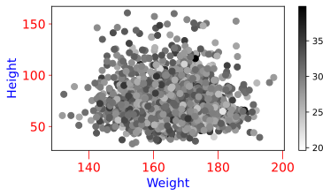

<h3>scatter_chart</h3>

<br>

<p align = "justify">
    This function shows a scatter chart.


</p>

```python
scatter_chart(**kwargs)
```

Input variables
{: .label .label-yellow }

<table style = "width:100%">
    <thead>
      <tr>
        <th>Name</th>
        <th>Description</th>
        <th>Type</th>
      </tr>
    </thead>
    <tr>
        <td><code>plot_setup</code></td>
        <td><p align="justify">Setup chart Dictionary with the following keys:</p></td>
        <td>Dictionary</td>
    </tr>
    <tr>
        <td><code>name</code></td>
        <td><p align="justify">Path + name figure (key required in plot_setup)</p></td>
        <td>String</td>
    </tr>
    <tr>
        <td><code>width</code></td>
        <td><p align="justify">Figure width in SI units (key required in plot_setup)</p></td>
        <td>Float</td>
    </tr>
    <tr>
        <td><code>height</code></td>
        <td><p align="justify">Figure height in SI units (key required in plot_setup)</p></td>
        <td>Float</td>
    </tr>
    <tr>
        <td><code>extension</code></td>
        <td><p align="justify">File extension (key required in plot_setup)</p></td>
        <td>String</td>
    </tr>
    <tr>
        <td><code>dots_per_inch</code></td>
        <td><p align="justify">The resolution in dots per inch (key required in plot_setup)</p></td>
        <td>Integer</td>
    </tr>
    <tr>
        <td><code>marker_size</code></td>
        <td><p align="justify">List of marker sizes (key required in plot_setup)</p></td>
        <td>List</td>
    </tr>
    <tr>
        <td><code>y_axis_label</code></td>
        <td><p align="justify">y axis label (key required in plot_setup)</p></td>
        <td>String</td>
    </tr>
    <tr>
        <td><code>y_axis_size</code></td>
        <td><p align="justify">y axis size (key required in plot_setup)</p></td>
        <td>Integer</td>
    </tr>
    <tr>
        <td><code>x_axis_label</code></td>
        <td><p align="justify">x axis label (key required in plot_setup)</p></td>
        <td>String</td>
    </tr>
    <tr>
        <td><code>x_axis_size</code></td>
        <td><p align="justify">x axis size (key required in plot_setup)</p></td>
        <td>Integer</td>
    </tr>
    <tr>
        <td><code>labels_size</code></td>
        <td><p align="justify">Labels size (key required in plot_setup)</p></td>
        <td>Integer</td>
    </tr>
    <tr>
        <td><code>labels_color</code></td>
        <td><p align="justify">Labels color (key required in plot_setup)</p></td>
        <td>String</td>
    </tr>
    <tr>
        <td><code>axises_color</code></td>
        <td><p align="justify">Axises color (key required in plot_setup)</p></td>
        <td>String</td>
    </tr>
    <tr>
        <td><code>on_grid</code></td>
        <td><p align="justify">Grid on or off (key required in plot_setup)</p></td>
        <td>Boolean</td>
    </tr>
    <tr>
        <td><code>y_log</code></td>
        <td><p align="justify">y log scale (key required in plot_setup)</p></td>
        <td>Boolean</td>
    </tr>
    <tr>
        <td><code>x_log</code></td>
        <td><p align="justify">x log scale (key required in plot_setup)</p></td>
        <td>Boolean</td>
    </tr>
    <tr>
        <td><code>legend</code></td>
        <td><p align="justify">List of legends (key required in plot_setup)</p></td>
        <td>List</td>
    </tr>
    <tr>
        <td><code>legend_location</code></td>
        <td><p align="justify">Legend location (key required in plot_setup)</p></td>
        <td>String</td>
    </tr>
    <tr>
        <td><code>size_legend</code></td>
        <td><p align="justify">Legend size (key required in plot_setup)</p></td>
        <td>Integer</td>
    </tr>
    <tr>
        <td><code>dataset</code></td>
        <td><p align="justify">Dataset. Add key 'colorbar' for colorbar in scatterplot</p></td>
        <td>Dictionary</td>
    </tr>
    <tr>
        <td><code>x0</code></td>
        <td><p align="justify">x axis values for the first line (key required in dataset)</p></td>
        <td>List or array</td>
    </tr>
    <tr>
        <td><code>y0</code></td>
        <td><p align="justify">y axis values for the first line (key required in dataset)</p></td>
        <td>List or array</td>
    </tr>
    <tr>
        <td><code>x1</code></td>
        <td><p align="justify">x axis values for the second line (key required in dataset)</p></td>
        <td>List or array</td>
    </tr>
    <tr>
        <td><code>y1</code></td>
        <td><p align="justify">y axis values for the second line (key required in dataset)</p></td>
        <td>List or array</td>
    </tr>
    <tr>
        <td><code>xn</code></td>
        <td><p align="justify">x axis values for the n-th line (key required in dataset)</p></td>
        <td>List or array</td>
    </tr>
    <tr>
        <td><code>yn</code></td>
        <td><p align="justify">y axis values for the n-th line (key required in dataset)</p></td>
        <td>List or array</td>
    </tr>
    <tr>
        <td><code>colorbar</code></td>
        <td><p align="justify">List of colorbar values (key required in dataset when colorbar is used. If not, it is not necessary)</p></td>
        <td>List</td>
    </tr>
</table>

Output variables
{: .label .label-yellow }

<table style = "width:100%">
    <thead>
      <tr>
        <th>Name</th>
        <th>Description</th>
        <th>Type</th>
      </tr>
    </thead>
    <tr>
        <td><code>None</code></td>
        <td>The function displays the plot on the screen and saves it to the local folder of the <code>.ipynb</code> or <code>.py</code> </td>
        <td>None</td>
    </tr>
</table>

Example 1
{: .label .label-blue }

<p align = "justify">
    <i>
        Use the <code>scatter_chart</code> function to perform a task.
    </i>
</p>

<p align = "justify">We use the <code>SCATTER_CHART</code> function to plot a relationships among height, weight, and age.</p>

```python
# Data
height = list(np.random.normal(loc=165, scale=10, size=2000))
weight = list(np.random.gumbel(loc=65, scale=15, size=2000))
age = list(np.random.normal(loc=30, scale=3.0, size=2000))
df = pd.DataFrame({'x': height,
                   'y': weight,
                   'colorbar': age # or 'colorbar': Use None if you wish chart without color bar and fill the colorbar argument 'CMAP COLOR' with False
                   })

# Chart setup
chart_config = {
    'name': 'figure1-3-1',
    'width': 15.,
    'height': 7.5,
    'marker size': 50,
    'cmap color': 'binary',
    'x axis label': 'Weight',
    'x axis size': 14,
    'y axis label': 'Height',
    'y axis size': 14,
    'axes color': 'red',
    'labels size': 14,
    'labels color': 'blue',
    'on grid?': False,
    'y log': False,
    'x log': False,
    'dots per inch': 600,
    'extension': 'svg',
}

# Data statement
data = {'dataset': df}

# Call function
scatter_chart(dataset=data, plot_setup=chart_config)
```

<center></center>
<p align = "center"><b>Figure 1.</b> Relationships among height, weight, and age.</p>

[Notebook example](https://drive.google.com/file/d/1rgeYI5gFkBCvLKVrqS4w_W9SKoq_LXW_/view?usp=sharing){: .btn .btn-outline }

