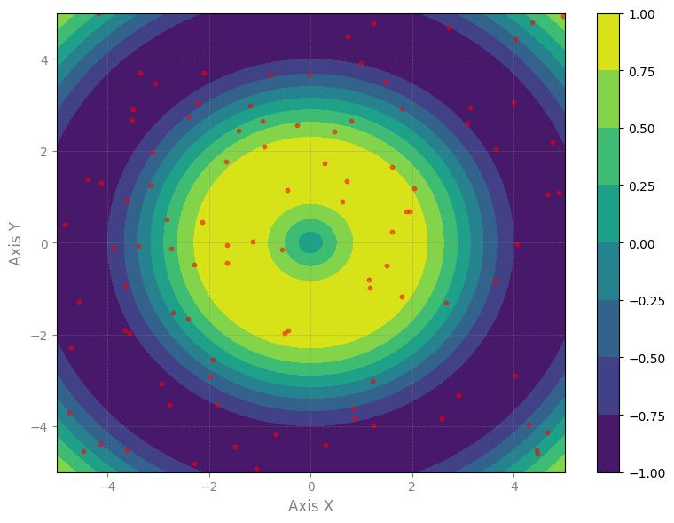

<h3>scatter_mesh_grid</h3>

<br>

<p align="justify">
    This function creates a scatter mesh grid chart with filled contours and overlayed scatter points.

</p>

```python
scatter_mesh_grid(**kwargs)
```

Input variables
{: .label .label-yellow }

<table style="width:100%">
    <thead>
      <tr>
        <th>Name</th>
        <th>Description</th>
        <th>Type</th>
      </tr>
    </thead>
    <tr>
        <td><code>plot_setup</code></td>
        <td>
            <p align="justify">Setup chart Dictionary with the following keys:</p>
            <ul>
                <li><code>name</code>: Path + name of the figure</li>
                <li><code>width</code>: Figure width in SI units</li>
                <li><code>height</code>: Figure height in SI units</li>
                <li><code>marker_size</code>: Size of the scatter markers</li>
                <li><code>color_map</code>: Color map for the mesh grid</li>
                <li><code>y_axis_label</code>: Label for the y axis</li>
                <li><code>y_axis_size</code>: Font size for the y axis label</li>
                <li><code>x_axis_label</code>: Label for the x axis</li>
                <li><code>x_axis_size</code>: Font size for the x axis label</li>
                <li><code>labels_size</code>: Font size for labels</li>
                <li><code>labels_color</code>: Color of the labels</li>
                <li><code>axises_color</code>: Color of the axes</li>
                <li><code>on_grid</code>: Whether to display grid lines</li>
                <li><code>y_log</code>: Whether to use a logarithmic scale for the y axis</li>
                <li><code>x_log</code>: Whether to use a logarithmic scale for the x axis</li>
                <li><code>dots_per_inch</code>: Resolution in dots per inch</li>
                <li><code>extension</code>: File extension for saving the figure</li>
            </ul>
        </td>
        <td>Dictionary</td>
    </tr>
    <tr>
        <td><code>dataset</code></td>
        <td>
            <p align="justify">Dataset to plot</p>
        </td>
        <td>List or array</td>
    </tr>
</table>

Output variables
{: .label .label-yellow }

<table style="width:100%">
    <thead>
      <tr>
        <th>Name</th>
        <th>Description</th>
        <th>Type</th>
      </tr>
    </thead>
    <tr>
        <td><code>None</code></td>
        <td>The function displays the scatter mesh grid plot on the screen and saves it to the local folder of the <code>.ipynb</code> or <code>.py</code></td>
        <td>None</td>
    </tr>
</table>

Example 1
{: .label .label-blue }

<p align="justify">
    <i>
        Use the <code>scatter_mesh_grid</code> function to create a scatter mesh grid plot with filled contours and scatter points overlayed.
    </i>
</p>

```python
import numpy as np

x = np.linspace(-5, 5, 100)
y = np.linspace(-5, 5, 100)
z = np.sin(np.sqrt(np.add.outer(x**2, y**2))) # Exemplo de função para o mesh grid

# Data
df = {
    'x': y,
    'y': x,
    'z': z,  
    'x_points': np.random.uniform(-5, 5, 100),
    'y_points': np.random.uniform(-5, 5, 100),
}

# Chart setup
chart_config = {
                'name': 'scatter_mesh_grid_plot',
                'width': 8,
                'height': 6,
                'extension': 'jpg',
                'dots_per_inch': 100,
                'marker_size': 10,
                'color_map': 'viridis',
                'y_axis_label': 'Axis Y',
                'y_axis_size': 12,
                'x_axis_label': 'Axis X',
                'x_axis_size': 12,
                'labels_size': 10,
                'labels_color': 'black',
                'axises_color': 'gray',
                'on_grid': True,
                'y_log': False,
                'x_log': False,
            }

# Call function
scatter_mesh_grid(dataset=df, plot_setup=chart_config)
```

<center></center>
<p align="center"><b>Figure 1.</b> Scatter Mesh Grid Plot with Filled Contours and Scatter Points.</p>

[Notebook example](https://drive.google.com/file/d/1rf2oZHfnTU4MBpZyqr25tsnUi26uwgd3/view?usp=sharing){: .btn .btn-outline }