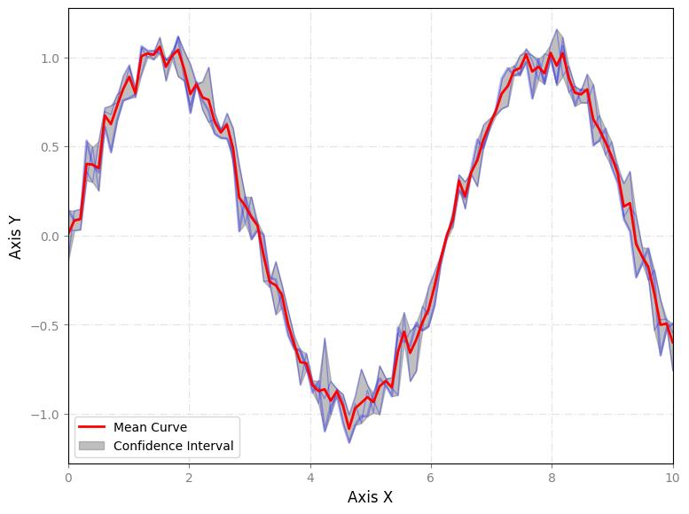

Aqui está a documentação em Markdown para a função `smooth_line`:

```markdown
---
layout: home
title: smooth_line
parent: Charts
nav_order: 8
has_toc: false
---

<h3>smooth_line</h3>

<br>

<p align="justify">
    This function creates a smooth line chart with optional log scales, grid, and customization options for line styles, colors, and labels.

</p>

```python
smooth_line(**kwargs)
```

Input variables
{: .label .label-yellow }

<table style="width:100%">
    <thead>
      <tr>
        <th>Name</th>
        <th>Description</th>
        <th>Type</th>
      </tr>
    </thead>
    <tr>
        <td><code>plot_setup</code></td>
        <td><p align="justify">Setup chart dictionary with the following keys:</p></td>
        <td>Dictionary</td>
    </tr>
    <tr>
        <td><code>name</code></td>
        <td><p align="justify">Path + name of the figure (key required in plot_setup)</p></td>
        <td>String</td>
    </tr>
    <tr>
        <td><code>width</code></td>
        <td><p align="justify">Figure width in SI units (key required in plot_setup)</p></td>
        <td>Float</td>
    </tr>
    <tr>
        <td><code>height</code></td>
        <td><p align="justify">Figure height in SI units (key required in plot_setup)</p></td>
        <td>Float</td>
    </tr>
    <tr>
        <td><code>extension</code></td>
        <td><p align="justify">File extension (key required in plot_setup)</p></td>
        <td>String</td>
    </tr>
    <tr>
        <td><code>dots_per_inch</code></td>
        <td><p align="justify">Resolution in dots per inch (key required in plot_setup)</p></td>
        <td>Integer</td>
    </tr>
    <tr>
        <td><code>line_width</code></td>
        <td><p align="justify">List of line widths (key required in plot_setup)</p></td>
        <td>List of Integers</td>
    </tr>
    <tr>
        <td><code>line_style</code></td>
        <td><p align="justify">List of line styles (key required in plot_setup)</p></td>
        <td>List of Strings</td>
    </tr>
    <tr>
        <td><code>y_axis_label</code></td>
        <td><p align="justify">y axis label (key required in plot_setup)</p></td>
        <td>String</td>
    </tr>
    <tr>
        <td><code>x_axis_label</code></td>
        <td><p align="justify">x axis label (key required in plot_setup)</p></td>
        <td>String</td>
    </tr>
    <tr>
        <td><code>labels_size</code></td>
        <td><p align="justify">Labels size (key required in plot_setup)</p></td>
        <td>Integer</td>
    </tr>
    <tr>
        <td><code>labels_color</code></td>
        <td><p align="justify">Labels color (key required in plot_setup)</p></td>
        <td>String</td>
    </tr>
    <tr>
        <td><code>x_axis_size</code></td>
        <td><p align="justify">x axis size (key required in plot_setup)</p></td>
        <td>Integer</td>
    </tr>
    <tr>
        <td><code>y_axis_size</code></td>
        <td><p align="justify">y axis size (key required in plot_setup)</p></td>
        <td>Integer</td>
    </tr>
    <tr>
        <td><code>axises_color</code></td>
        <td><p align="justify">Axes color (key required in plot_setup)</p></td>
        <td>String</td>
    </tr>
    <tr>
        <td><code>x_limit</code></td>
        <td><p align="justify">x axis limits (key required in plot_setup)</p></td>
        <td>List of Floats</td>
    </tr>
    <tr>
        <td><code>y_limit</code></td>
        <td><p align="justify">y axis limits (key required in plot_setup)</p></td>
        <td>List of Floats</td>
    </tr>
    <tr>
        <td><code>chart_color</code></td>
        <td><p align="justify">List of chart colors (key required in plot_setup)</p></td>
        <td>List of Strings</td>
    </tr>
    <tr>
        <td><code>on_grid</code></td>
        <td><p align="justify">Grid on or off (key required in plot_setup)</p></td>
        <td>Boolean</td>
    </tr>
    <tr>
        <td><code>y_log</code></td>
        <td><p align="justify">y log scale (key required in plot_setup)</p></td>
        <td>Boolean</td>
    </tr>
    <tr>
        <td><code>x_log</code></td>
        <td><p align="justify">x log scale (key required in plot_setup)</p></td>
        <td>Boolean</td>
    </tr>
    <tr>
        <td><code>legend_location</code></td>
        <td><p align="justify">Legend location (key required in plot_setup)</p></td>
        <td>String</td>
    </tr>
    <tr>
        <td><code>size_legend</code></td>
        <td><p align="justify">Legend size (key required in plot_setup)</p></td>
        <td>Integer</td>
    </tr>
    <tr>
        <td><code>dataset</code></td>
        <td><p align="justify">Dataset with the following keys:</p></td>
        <td>Dictionary</td>
    </tr>
    <tr>
        <td><code>dataset['x']</code></td>
        <td><p align="justify">x axis values (key required in dataset)</p></td>
        <td>List or array</td>
    </tr>
    <tr>
        <td><code>dataset['curve1']</code></td>
        <td><p align="justify">y axis values for the first curve (key required in dataset)</p></td>
        <td>List or array</td>
    </tr>
    <tr>
        <td><code>dataset['curve2']</code></td>
        <td><p align="justify">y axis values for the second curve (key required in dataset)</p></td>
        <td>List or array</td>
    </tr>
    <tr>
        <td><code>dataset['curveN']</code></td>
        <td><p align="justify">y axis values for the n-th curve (key required in dataset)</p></td>
        <td>List or array</td>
    </tr>
</table>

Output variables
{: .label .label-yellow }

<table style="width:100%">
    <thead>
      <tr>
        <th>Name</th>
        <th>Description</th>
        <th>Type</th>
      </tr>
    </thead>
    <tr>
        <td><code>None</code></td>
        <td>The function displays the smooth line chart on the screen and saves it to the local folder of the <code>.ipynb</code> or <code>.py</code></td>
        <td>None</td>
    </tr>
</table>

Example 1
{: .label .label-blue }

<p align="justify">
    <i>
        Use the <code>smooth_line</code> function to create a smooth line chart from the dataset.
    </i>
</p>

```python
from easyplot_toolbox.easyplot import smooth_line
import numpy as np

x = np.linspace(0, 10, 100)
curve1 = np.sin(x) + np.random.normal(0, 0.1, len(x))
curve2 = np.sin(x) + np.random.normal(0, 0.1, len(x))
curve3 = np.sin(x) + np.random.normal(0, 0.1, len(x))

df = {
    'x': x,
    'curve1': curve1,
    'curve2': curve2,
    'curve3': curve3
}

# Chart setup
chart_config = {
    'name': 'smooth_line_with_confidence_interval',
    'width': 20,  
    'height': 15, 
    'extension': 'jpg',
    'dots_per_inch': 100,
    'line_width': [2],  
    'line_style': ['-'],  
    'y_axis_label': 'Axis Y',
    'x_axis_label': 'Axis X',
    'labels_size': 12,
    'labels_color': 'black',
    'x_axis_size': 10,
    'y_axis_size': 10,
    'axises_color': 'gray',
    'x_limit': [0, 10],  
    'y_limit': [None, None],  
    'chart_color': ['blue'],  
    'on_grid': True,
    'y_log': False,
    'x_log': False,
    'legend_location': 'best',
    'size_legend': 10,
}

# Call function
smooth_line(dataset=df, plot_setup=chart_config)
```

<center></center>
<p align="center"><b>Figure 1.</b> Joyplot of the dataset.</p>

[Notebook example](https://drive.google.com/file/d/1rf2oZHfnTU4MBpZyqr25tsnUi26uwgd3/view?usp=sharing){: .btn .btn-outline }