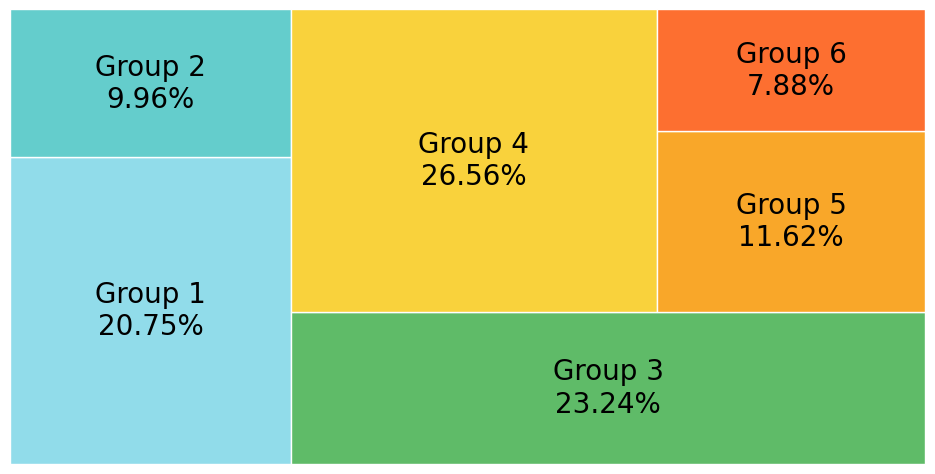

<h3>treemap_chart</h3>

<br>

<p align = "justify">
    This function creates a treemap chart.
</p>

```python
treemap_chart(**kwargs)
```

Input variables  
{: .label .label-yellow }

<table style = "width:100%">
    <thead>
      <tr>
        <th>Name</th>
        <th>Description</th>
        <th>Type</th>
      </tr>
    </thead>
    <tr>
        <td><code>plot_setup</code></td>
        <td>
            <p align="justify">Setup chart dictionary with the following keys:</p>
            <ul>
                <li><code>name</code>: Path + name of the figure</li>
                <li><code>width</code>: Figure width in SI units</li>
                <li><code>height</code>: Figure height in SI units</li>
                <li><code>dots_per_inch</code>: The resolution in dots per inch</li>
                <li><code>extension</code>: File extension</li>
                <li><code>colors</code>: List of colors for the treemap</li>
                <li><code>labels</code>: List of labels for the treemap</li>
                <li><code>label size</code>: Font size of the labels</li>
            </ul>
        </td>
        <td>Dictionary</td>
    </tr>
    <tr>
        <td><code>dataset</code></td>
        <td>
            <p align="justify">Dataset to plot</p>
        </td>
        <td>List or array</td>
    </tr>
</table>

Output variables  
{: .label .label-yellow }

<table style = "width:100%">
    <thead>
      <tr>
        <th>Name</th>
        <th>Description</th>
        <th>Type</th>
      </tr>
    </thead>
    <tr>
        <td><code>None</code></td>
        <td><p align="justify">The function displays the plot on the screen and saves it to the local folder of the <code>.ipynb</code> or <code>.py</code></p></td>
        <td>None</td>
    </tr>
</table>

Example 1  
{: .label .label-blue }

<p align = "justify">
    <i>Use the <code>treemap_chart</code> function to perform a task.</i>
</p>

```python
# Data
DF = pd.DataFrame({'values': [250, 120, 280, 320, 140, 95]})

# Chart setup
plot_setup = {
    'name': 'figure1-8-1',
    'width': 30,
    'height': 15,
    'colors': ['#91DCEA', '#64CDCC', '#5FBB68', '#F9D23C', '#F9A729', '#FD6F30'],
    'labels': ['Group 1', 'Group 2', 'Group 3', 'Group 4', 'Group 5', 'Group 6'],
    'label size': 20,
    'extension': 'svg',
    'dots per inch': 600
}


# Data statement 
DATA = {'dataset': DF}

# Call function
treemap_chart(dataset = DATA, plot_setup = plot_setup)
```

<center></center>
<p align = "center"><b>Figure 1.</b> Example Treemap Chart.</p>